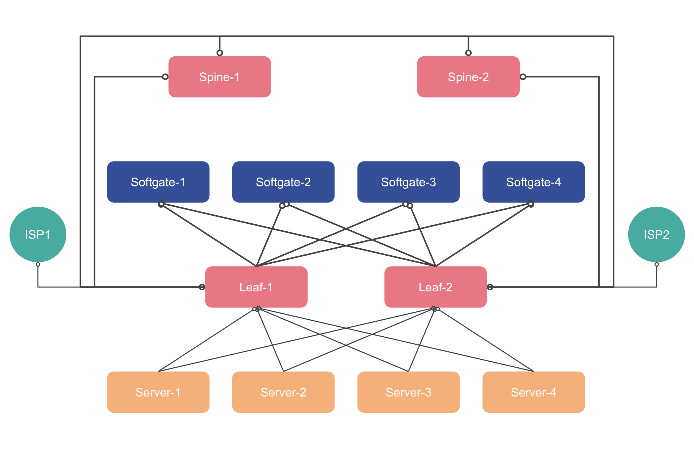

.. meta::
  :description: Netris-CloudStack Integration

High-Level Concept of Integration
=================================

The integration of Netris with Apache CloudStack provides a robust and scalable networking solution, addressing the limitations of traditional switch fabrics and enhancing the network capabilities of CloudStack.

How It Works
------------

* Hypervisors as VTEPs: Hypervisors terminate VXLAN tunnels, acting as Virtual Tunnel Endpoints (VTEPs).
* BGP EVPN Signaling: Netris uses BGP EVPN to exchange MAC and IP address information, creating a dynamic and scalable control plane for VXLAN.
* Integration Points:

  * The CloudStack Controller communicates with the Netris Controller API to exchange network configuration and metadata.
  * VXLAN fabrics are extended between CloudStack and physical switch networks using BGP/EVPN.

Challenges Addressed
--------------------

* Overcomes the VLAN limitation of 4096 IDs by leveraging VXLAN, supporting millions of isolated VPCs.
* Eliminates the “island” effect of CloudStack’s multicast-based VXLAN by integrating with the physical switch fabric.
* Replaces CloudStack’s virtual router with Netris SoftGate, offering scalable NAT, load balancing, and traffic control.

Benefits
--------

* Scalability: Support for millions of VPCs with overlapping IPs.
* AWS-Like Services: Enables Direct Connect functionality and scalable load balancing.
* Automation: Simplifies network operations with centralized control via the Netris Controller.
* Cost-Efficiency: Uses multi-vendor hardware and commodity servers, reducing infrastructure costs.

Use Cases
---------

* Large-scale Apache CloudStack Providers needing a scalable alternative to VLANs.
* Enterprises transforming their traditional data centers into private cloud environments.
* Hosting providers seeking AWS-like network functionality for their customers.

Compute and Network Architecture
================================

The current infrastructure for Netris-CloudStack integration is designed to support **scalable and dynamic** networking for cloud workloads.  This section outlines the key infrastructure components and their roles.

Diagram Overview
----------------

The diagram represents the interconnected infrastructure, consisting of:

1. **Leaf and Spine Switches**:

   - These switches form the **core networking fabric**, ensuring **high-speed, redundant, and fault-tolerant connectivity**.
   - **Spine switches** (Spine 1 and Spine 2) aggregate traffic and connect to **leaf switches**.
   - **Leaf switches** (Leaf 1 and Leaf 2) connect directly to **compute nodes and softgates**, handling **VXLAN encapsulation**.

2. **Softgates**:

  - Softgates play a critical role in integrating physical and virtual network environments. They are responsible for:

     - **NAT Functionality**: Facilitates secure communication between **private and external networks**.
     - **Elastic Load Balancer**: Distributes inbound traffic to multiple backend instances.
     - **Network Access Control**: Enforces security policies at the edge.

   - Additionally, Softgates bridge **VXLAN and traditional networking** and support **BGP/EVPN for dynamic routing**.

3. **Servers**:

   - **Server 1**:

     - Designated as the **CloudStack Management Node**, responsible for orchestrating the environment.
   - **Server 2, Server 3, and Server 4**:

     - These **KVM hypervisors** are managed by **CloudStack** and function as **VXLAN Tunnel Endpoints (VTEPs)**.

4. **OOB (Out-of-Band) Switch (If Present)**:

   - If available, an **OOB switch** provides an independent **management network** for accessing servers.
   - Allows administrators to:

     - Perform **software installations and updates**.
     - Troubleshoot and manage servers independently of the main network.

Network Flow
------------

1. **Hypervisor traffic** traverses **VXLAN tunnels**, dynamically configured via **BGP/EVPN**.
2. **Softgates handle routing** between overlay and underlay networks, ensuring seamless workload communication.
3. **CloudStack Controller** communicates with **Netris Controller API** to synchronize network configurations.
4. **Leaf and Spine switches** ensure a **highly available and scalable** fabric for compute workloads.
5. If an **OOB switch is available**, it provides **direct administrative access** to all servers.
6. **Softgates establish BGP sessions** for external connectivity, ensuring **public and private traffic reachability**.
