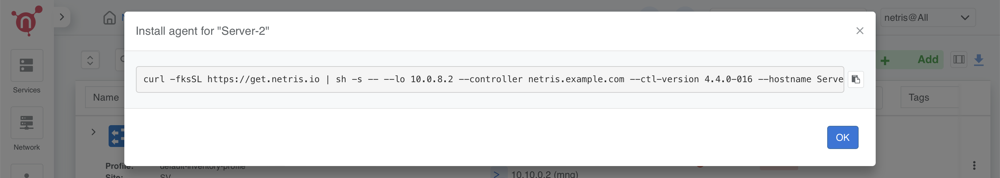
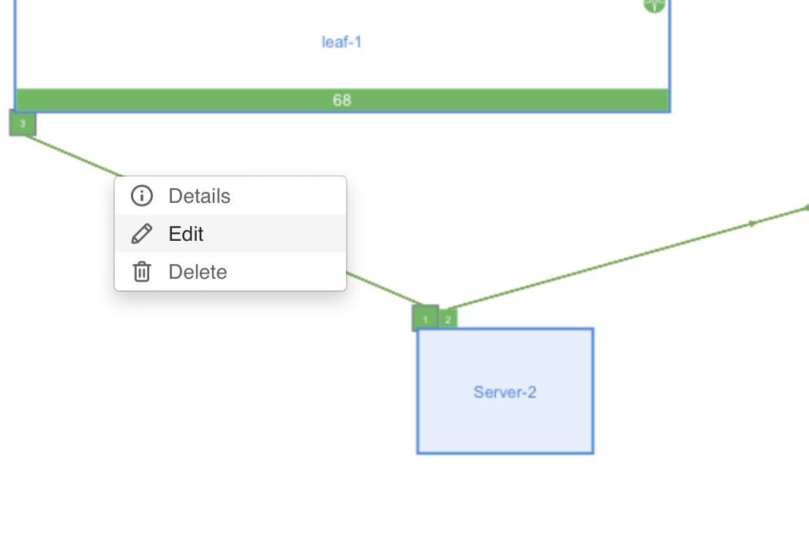
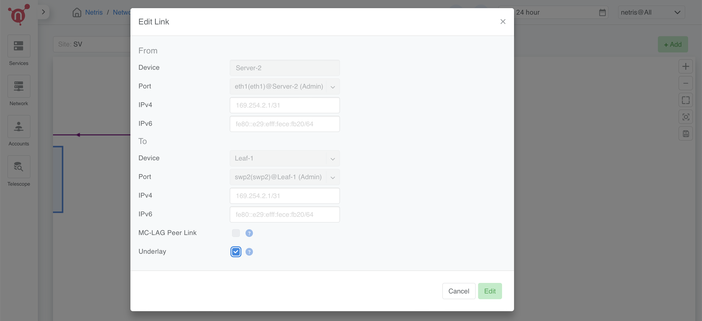

.. meta::
  :description: Netris-CloudStack Integration

Server Configuration and Software Installation
==============================================

Here we are going to configure the servers' network, install the `netris-cloudstack` agents on hypervisors, install CloudStack management software on `Server 1`, and install the CloudStack agent on `Server 2-4`.

Configuring Network on CloudStack Management Server (Server 1)
--------------------------------------------------------------

To set up the CloudStack **Management Server** (Server 1) effectively, we need to configure its **network**. The following steps describe how to prepare the server’s **network interfaces**, set up **bonding** for redundancy, and integrate it with the Netris-managed fabric.

Understanding the Network Layout
^^^^^^^^^^^^^^^^^^^^^^^^^^^^^^^^^^^

1. **eno1**:

  * Connected to the **Out-of-Band** (OOB) switch.
  * Used for administrative tasks, **package installation**, and **emergency access**.
  * This interface will remain **separate** from the **Netris fabric**.

2. **eno2** and **eno3**:

  * Connected to **leaf1** and **leaf2** switches in the Netris fabric, respectively.
  * These interfaces will be **bonded** to form bond0, ensuring link **redundancy** and better throughput through **LACP** (Link Aggregation Control Protocol).

3. **bond0**:

  * This bonded interface will **carry all traffic** routed through the Netris-managed network.
  * It will use an IP address within the 10.99.0.0/21 **subnet** for communication with CloudStack resources and the Netris fabric.

Netplan Configuration
^^^^^^^^^^^^^^^^^^^^^^^^^^

Below is a Netplan configuration file to set up the network:

.. code-block:: yaml

   network:
     ethernets:
       eno1:
         addresses:
           - 10.254.96.39/24
         routes:
           - to: 10.254.95.0/24
             via: 10.254.96.1
       eno2:
         dhcp4: false
         dhcp6: false
       eno3:
         dhcp4: false
         dhcp6: false
       eno4:
         dhcp4: false
         dhcp6: false
     bonds:
       bond0:
         interfaces:
           - eno2
           - eno3
         addresses:
           - 10.99.1.1/21
         nameservers:
           addresses:
             - 1.1.1.1
             - 8.8.8.8
           search:
             - netris.local
         routes:
           - to: default
             via: 10.99.0.1
         parameters:
           mode: 802.3ad
           lacp-rate: fast
           transmit-hash-policy: layer3+4
           mii-monitor-interval: 100

**Explanation**

1. **eno1** Configuration:

  - Assigned an IP address (10.254.96.39/24) for **OOB** management access.
  - A static **route** is added to ensure that the CloudStack Management Server **communicates** with the **Netris API** via the OOB network (10.254.95.0/24 via 10.254.96.1).

2. **eno2** and **eno3** Configuration:

  - These interfaces are explicitly **disabled** from **DHCP** to avoid conflicts as they are **part** **of** **bond0**.

3. **bond0** Configuration:

   - Bonded interface combines **eno2** and **eno3** for link redundancy and throughput.
   - Configured with the 10.99.1.1/21 IP address for connectivity within the **CloudStack Management** subnet.
   - Nameservers (1.1.1.1 and 8.8.8.8) and search domain (netris.local) ensure proper DNS resolution.
   - A **default route** (via 10.99.0.1) directs traffic to the gateway.

Netris Fabric Integration
- From the Netris side, **no** manual **configuration** is **required** for the bonded interface.
- Once the server is connected, the Netris fabric will **detect** **LACP** packets and **automatically** configure EVPN-MH (MultiHoming) for redundancy.

**Verification:**

1. After **applying** the **Netplan** configuration, use the following commands to verify:

.. code-block::

  sudo netplan apply

2. **Check** that **bond0** is up and operational with the correct **IP and default route**.

.. code-block::

  ip addr show bond0
  ip route show

3. Confirm that **LACP** is working by checking the **bond** status:

.. code-block::

  cat /proc/net/bonding/bond0

**Best Practices**

  - Keep eno1 isolated from the Netris fabric to ensure uninterrupted OOB management access.
  - Regularly monitor the bond interface (bond0) for any link failures or misconfigurations.

Install Netris-CloudStack Agent on Hypervisor Servers
---------------------------------------------------------

The **netris-cloudstack agent** acts as a bridge between **CloudStack** and the **Netris Controller**. It automates the **provisioning** and **configuration** of network resources required for **CloudStack’s operations on hypervisor nodes**.

Bringing Up NICs Before Installation
^^^^^^^^^^^^^^^^^^^^^^^^^^^^^^^^^^^^

For proper network initialization, ensure all NICs connected to the Netris fabric are brought up before installing the agent.

Run the following command for each NIC that is physically connected to the fabric:

.. code-block:: shell

  ip link set ens3 up
  ip link set ens4 up
  ip link set ens5 up  # Repeat for all NICs

To verify, run:

.. code-block:: shell

  ip link show | grep 'state UP'

Ensure all NICs are in the UP state before proceeding.

.. note::
   - If your infrastructure **does not have an OOB network**, your hypervisors will **not have internet access**.  
     Follow the **pre-installation steps** below to temporarily configure internet access **before proceeding** with the installation.
   - If you **have an OOB network**, proceed directly to **Installation Steps**.

Pre-Installation Steps (For Deployments Without OOB)
^^^^^^^^^^^^^^^^^^^^^^^^^^^^^^^^^^^^^^^^^^^^^^^^^^^^

.. warning::
   These steps are **only for users without an OOB network**. If your hypervisors **already have internet access via OOB**, **skip this section**.

1. **Assign an IP address** to the hypervisor’s **NIC connected to the Netris fabric**:

   .. code-block:: shell

      ip address add 10.55.1.1/21 dev ens3

2. **Set a temporary default route** via the **temporary OOB gateway**:

   .. code-block:: shell

      ip route add default via 10.55.0.1 metric 10

3. **Set DNS resolvers** to enable domain name resolution:

   .. code-block:: shell

      echo "nameserver 1.1.1.1" > /etc/resolv.conf
      echo "nameserver 8.8.8.8" >> /etc/resolv.conf

4. **Verify connectivity**:

   .. code-block:: shell

      ip addr show ens3      # Ensure the IP is assigned
      ping -c 4 10.55.0.1    # Check connectivity to the temporary gateway
      ping -c 4 1.1.1.1      # Check external connectivity
      curl -I https://www.google.com  # Verify internet access

After confirming connectivity, proceed with the **Netris-CloudStack Agent installation**.

Key Functions of the Netris-CloudStack Agent
^^^^^^^^^^^^^^^^^^^^^^^^^^^^^^^^^^^^^^^^^^^^

1. **Bridge Management**:

  - Automatically creates and configures the **cloudbr0** bridge on hypervisors based on the JSON configuration provided during setup.
  - Ensures the bridge is correctly associated with the **CloudStack Management Network**.

2. **Network Automation**:

  - Configures **VXLAN overlays** to extend **Layer 2 networks** across the **Netris fabric**.
  - Integrates with **Netris EVPN** to enable **dynamic exchange of MAC and IP address information**.

Installation Steps
^^^^^^^^^^^^^^^^^^

To provision the **netris-cloudstack agent** on the hypervisor servers (**Server 2-4**):

1. Navigate to: **Net → Inventory**.
2. Locate the desired server node (e.g., **Server 2**).
3. Click the **three vertical dots (⋮)** on the right-hand side of the node and select **Install Agent**.
4. A **one-line installer command** will appear. **Copy this command** to your clipboard.

   - **Note:** Each installer command is **unique to the specific node**.

5. **SSH into the server** and execute the copied command:

6. **Repeat this process** for each hypervisor server (**Servers 2, 3, and 4**).

Example Successful Output of One-Liner Script
^^^^^^^^^^^^^^^^^^^^^^^^^^^^^^^^^^^^^^^^^^^^^

Below is an example of a successful installation output after executing the **one-liner script** on a hypervisor server:

.. code-block:: shell

  root@Server-2:~# curl -fsSL https://get.netris.io | sh -s -- --lo 10.0.8.2 --controller netris.example.com --ctl-version 4.4.0-011 --hostname Server-2 --auth UTuO5CvRGtlaHFpnwGRHCBGeEwxerpr2uLuDIbBc --node-type acs_hyper
  === Installing Netris-CloudStack Agent ===
  + Configuring the Netris repository...
  + Updating list of available packages
    * Proceeding with the new version of netris config files
  + Configuring Netris-CloudStack Agent
  + Enabling bgpd in FRR
  + Restarting FRR service
  + Starting Netris-CloudStack Agent service
  === Netris-CloudStack Agent is now installed! ===
  + Get started with Netris: https://netris.io/docs/en/stable/

Verification Steps
^^^^^^^^^^^^^^^^^^

1. **Check the agent service** to ensure it is running:

   .. code-block:: shell

      systemctl status netris-cloudstack-agent.service

2. **Confirm that the `cloudbr0` bridge has been created** and has the correct IP address:

   .. code-block:: shell

      ip addr show cloudbr0

---

Checking Network Connectivity
^^^^^^^^^^^^^^^^^^^^^^^^^^^^^^^^^^^^^^^^^^^^^^^^^^^

.. note::
   - If your infrastructure **has an OOB network**, and **Underlay was enabled during link setup**, you **should be able to ping the VXLAN gateway (e.g., 10.100.0.1) now**.
   - If your infrastructure **does not have an OOB network**, and **Underlay is still disabled**, you **will NOT be able to ping the VXLAN gateway yet**.  
     Proceed to the **next step** to enable underlay.

.. tab-set::
  
  .. tab-item:: With OOB (Underlay Enabled)

      **Verify connectivity:**
      
      .. code-block:: shell

         ping -c 4 10.100.0.1  # This should work if underlay is enabled.

  .. tab-item:: Without OOB (Underlay Disabled)

      - **Skip connectivity checks for now.**
      - Proceed to **Enabling Underlay for Hypervisors** in the next step.

Finalizing the Network Setup
^^^^^^^^^^^^^^^^^^^^^^^^^^^^^^^^^^^^^^^^^^^^^^^^^^^

.. note::
   - If your infrastructure **did not have an OOB network**, and you created a **temporary OOB VNet**,  
     now is the time to **switch from the temporary connection** to **underlay networking**.

Step 1: Enable Underlay for Hypervisor Links
""""""""""""""""""""""""""""""""""""""""""""""""""

1. **Navigate to**: **Netris Controller → Net → Topology**.
2. **Find the hypervisor’s links** (e.g., Server 2 → Leaf-1).
3. **Right-click on the link** and select **Edit**.
4. **Enable the "Underlay" checkbox**.
5. **Click Save**.
6. **Repeat for all hypervisors (Server 2, 3, and 4)**.

Step 2: Verify VXLAN Connectivity
""""""""""""""""""""""""""""""""""""""""""""""""""""

1. **Reconnect to the server using the new cloudbr0 IP**:

   .. code-block:: shell

      ssh root@10.100.1.1

2. **Confirm that the gateway of the VXLAN VNet is now reachable**:

   .. code-block:: shell

      ping -c 4 10.100.0.1  # Now the gateway should respond

Step 3: Remove Temporary Configurations
""""""""""""""""""""""""""""""""""""""""""""""""""""

1. **Delete the temporary default route**:

   .. code-block:: shell

      ip route del default via 10.55.0.1

2. **Verify that the server is now using `cloudbr0` for network access**:

   .. code-block:: shell

      ip route show
      ip addr show cloudbr0
      ping -c 4 1.1.1.1
      curl -I https://www.google.com

**Keeping the Temporary OOB VNet for Emergency Access**
^^^^^^^^^^^^^^^^^^^^^^^^^^^^^^^^^^^^^^^^^^^^^^^^^^^^^^^^^^^^^^^^^^^^^^^^^^

.. note::
   If your infrastructure **does not have a dedicated OOB network**, you can **retain the temporary VNet** as an **emergency access method**.

Why Keep the Emergency OOB?
""""""""""""""""""""""""""""""""""""

- **Allows access to the hypervisors if underlay networking fails**.
- **Can be used for troubleshooting or upgrades** without disrupting the overlay network.
- **Provides a backup path to manage servers** without depending on cloudbr0.

How to Use Emergency OOB?
""""""""""""""""""""""""""""""""""""

1. **Disable underlay** on a hypervisor link:

   ..

      Navigate to Net > Topology, edit the link, and uncheck "Underlay"

2. **Reconnect to the hypervisor using the OOB IP**:

   .. code-block:: shell

      ssh root@10.55.1.1

3. **Perform necessary maintenance**, then **re-enable underlay** when done.

.. note::

   **Persisting OOB IP Configuration (Recommended)**

   For long-term usability, configure the **emergency OOB IP persistently** using **Netplan**:

Managing Additional NICs on the Server
^^^^^^^^^^^^^^^^^^^^^^^^^^^^^^^^^^^^^^

After the **Netris-CloudStack Agent** is installed and operational, it's important to understand how networking is handled for **other NICs** on the hypervisor.

1. **Netris-CloudStack Agent Only Configures Underlay NICs**
   
   - The **Netris-CloudStack Agent** **only** configures **NICs that have their link marked as underlay** in **Netris**.
   - Any **other NICs** on the server will remain **untouched** by the agent.
   - This means that **you can configure and use other NICs just like on a normal server**.

2. **Where Does Netris-CloudStack Agent Store Network Configurations?**
   
   - The **Netris-CloudStack Agent** configures the networking for **underlay-enabled NICs** using the following Netplan configuration file:

   .. code-block:: shell

      /etc/netplan/10-netris.yaml

   - The agent **does not modify any other files**.

3. **How to Configure Additional NICs Manually?**
   
   - If you need to **configure other NICs** on your server (e.g., for additional network connections, storage networks, or monitoring purposes), **do not modify `/etc/netplan/10-netris.yaml`**.
   - Instead, create a **new** Netplan configuration file (e.g., `/etc/netplan/05-custom.yaml`):

   .. code-block:: shell

      sudo vim /etc/netplan/05-custom.yaml

   - Add your custom network settings. For example:

   .. code-block:: yaml

      network:
        version: 2
        ethernets:
          ens5:
            dhcp4: no
            addresses:
              - 192.168.50.10/24

   - Save the file and **apply the new configuration**:

   .. code-block:: shell

      sudo netplan apply

4. **Important Warning: Restart FRR After Netplan Apply**
   
   - **Whenever you run `netplan apply`**, it may **remove BGP routes** that the **Netris-CloudStack Agent** has established through **FRR**.
   - This can cause connectivity issues, especially for **BGP sessions that depend on those routes**.
   - **Workaround**: **Restart the FRR service every time after running `netplan apply`**.

   .. code-block:: shell

      sudo systemctl restart frr

   - This ensures that all **BGP routes are properly re-established** after Netplan makes changes.

Summary
"""""""""

- ✔ The **Netris-CloudStack Agent** **only manages underlay-enabled NICs**, and other NICs are fully customizable.  
- ✔ Always use a **separate Netplan file** (e.g., `/etc/netplan/05-custom.yaml`) for any manual network configurations.  
- ✔ **If you apply Netplan changes (`netplan apply`), always restart FRR afterward** to prevent network disruptions.  

Install CloudStack Management Service
-------------------------------------

The user is responsible for installing the **CloudStack Management** service. You are free to follow your preferred method for installation. **Netris isolation method** is officially available in CloudStack starting from version **21**.

For earlier access, the development version is available at **ShapeBlue's repository**:

**Repository URL:** `http://packages.shapeblue.com/cloudstack/custompublic/kapik/`

Installation Steps
^^^^^^^^^^^^^^^^^^

Follow these steps to install the CloudStack Management service:

1. **Create the keyring directory**:

   .. code-block:: shell

      mkdir -p /etc/apt/keyrings

2. **Add the repository key**:

   .. code-block:: shell

      wget -O- http://packages.shapeblue.com/release.asc | gpg --dearmor | sudo tee /etc/apt/keyrings/cloudstack.gpg > /dev/null

3. **Add the repository**:

   .. code-block:: shell

      echo deb [signed-by=/etc/apt/keyrings/cloudstack.gpg] http://packages.shapeblue.com/cloudstack/custompublic/kapik/debian/4.20 / > /etc/apt/sources.list.d/cloudstack.list

4. **Update the package list**:

   .. code-block:: shell

      apt-get update -y
