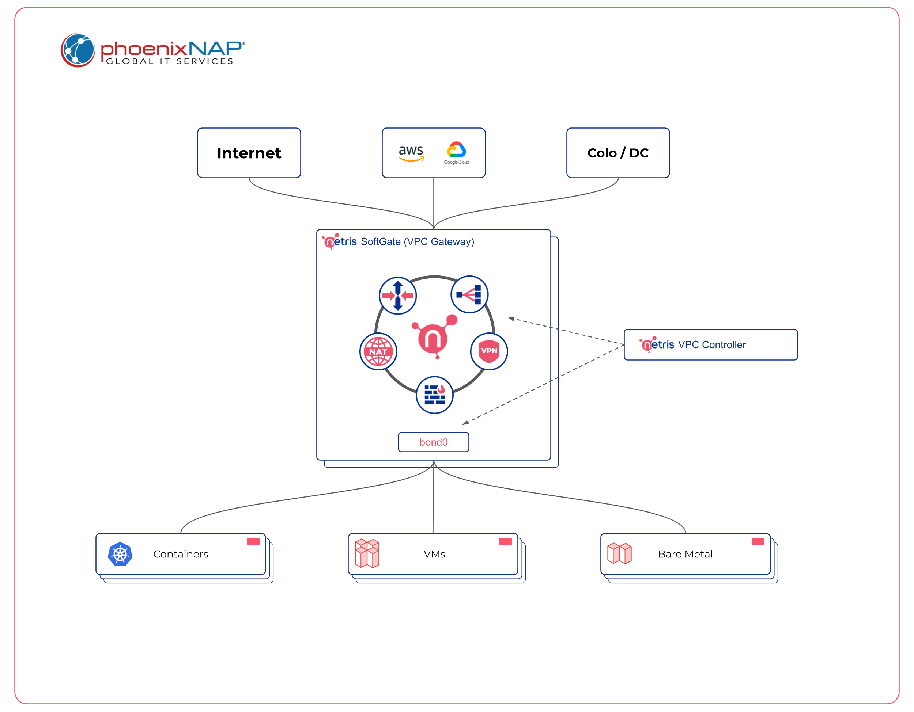
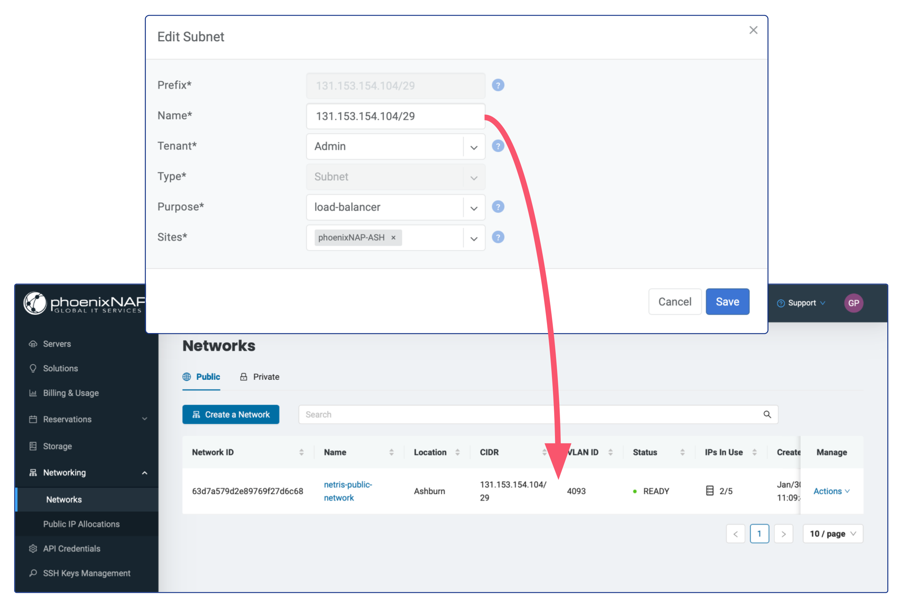

######################################
Netris VPC for phoenixNAP BMC Overview
######################################

Introduction
-------------

Netris VPC for phoenixNAP BMC is a solution that enables VPC network functionality in phoenixNAP's Bare Metal Cloud. Netris VPC can be used for all or part of the servers/network traffic. Therefore it is easy to integrate Netris VPC even into existing production Networks without introducing disruptive procedures.

Concept
--------

There is **an agent** inside the Netris VPC controller for phoenixNAP BMC that communicates to phoenixNAP API once the :ref:`integration has been enabled<phxnap_api>`. That agent is responsible for metadata synchronization between phoenixNAP BMC and Netris VPC controller. Also, it configures the BMC network services based on the services defined in the Netris VPC controller. 

**SoftGate** is a highly optimized automatic Linux gateway, which in turn communicates with the Netris VPC controller via an encrypted protocol. A SoftGate node (typically two of them for redundancy) is a regular BMC server that should be deployed on desired phoenixNAP location. Once the server has been :ref:`deployed and provisioned<phxnap_sgs>`, it starts consuming the BMC public and private networks with various VLANS. 

Due to phoenixNAP BMC creating a new VLAN for each server's Public IP Allocation and Public Network/Private Network, we decided to use the upper VLANS Range - 3000-4094 (if you need to change the default range, that can be done in the Netris Site settings). Netris will consume VLANS only from that range. Thus safely isolating VPC traffic flows from all other traffic flows that may exist on the BMC network. 

SoftGate node becomes the default gateway for the workloads consuming the VPC network. PhoenixNAP BMC Private Network becomes a transport network for moving 802.1q tagged packets between SoftGate nodes and workload servers. Netris also creates a Public Network in the phoenixNAP BMC when the IP Addresses from Public IP Allocations (passed to Netris VPC) :ref:`have been used<phxnap_services>` in any Netris VPC's services. Besides Public/Private Networks creation Netris also attaches all necessary servers to that networks. Therefore, you don’t need to worry about assigning servers to the networks on the phoenixNAP side, Netris will handle that automatically when that makes sense.

**What's next**

* :doc:`Installing a Netris Controller on phoenixNAP BMC server <phoenixnap-bmc-install-netris-controller>` 
* :doc:`Enable phoenixNAP BMC API integration <phoenixnap-bmc-api-integration-enablement>` 
* :doc:`Provisioning Netris SoftGate nodes in phoenixNAP BMC <phoenixnap-bmc-adding-netris-softgate-nodes>` 
* :doc:`IPAM Setup for Services <phoenixnap-bmc-ipam-setup>` 

Usage

* :doc:`Using NAT services in phoenixNAP BMC <phoenixnap-bmc-using-nat>` 
* :doc:`Using V-Net (isolated virtual network) services in phoenixNAP BMC <phoenixnap-bmc-using-vnet>` 
* :doc:`Using on-demand (elastic) L4 Load Balancer service in phoenixNAP BMC <phoenixnap-bmc-using-l4lb>` 
