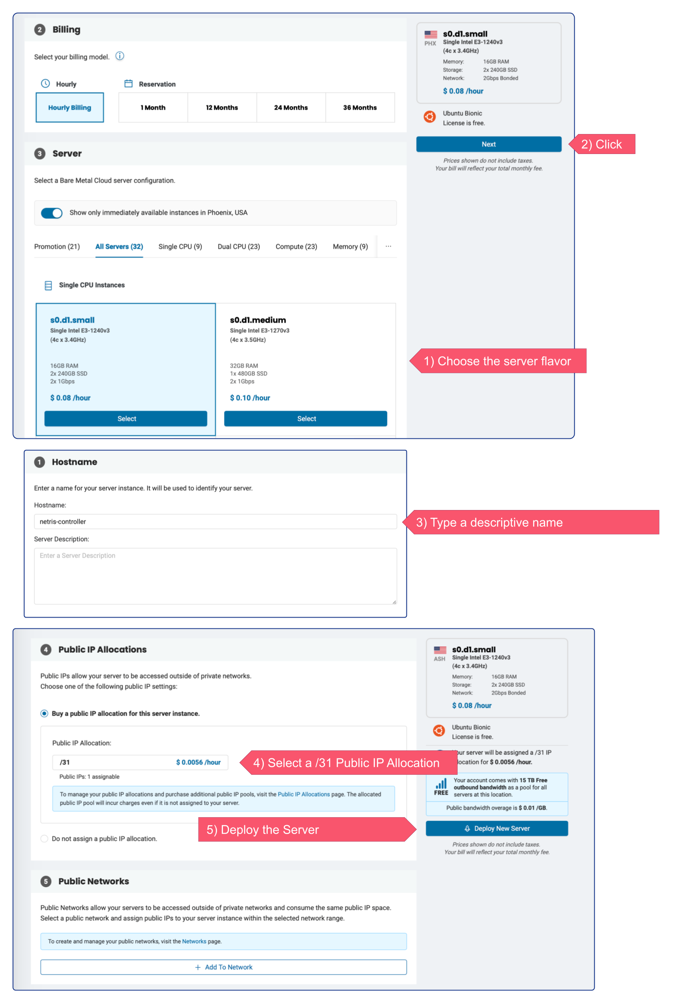
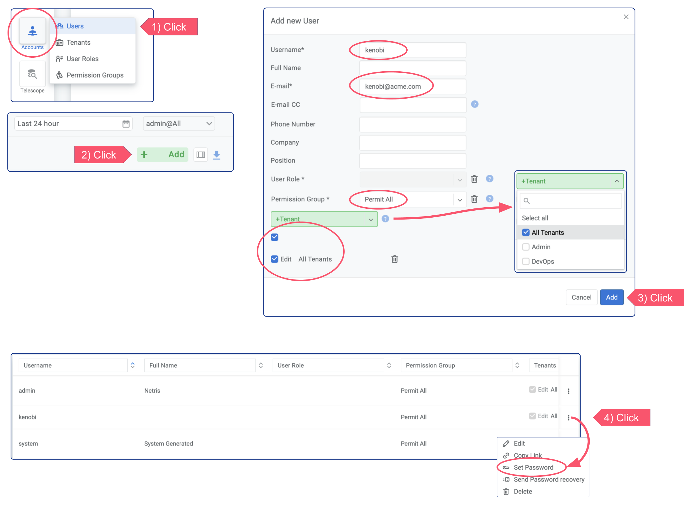

.. meta::
    :description: Installing a Netris Controller in phoenixNAP BMC

=================================================================
Installing a Netris Controller on phoenixNAP BMC server
=================================================================

Installation Steps
------------------

You can install the Netris controller almost on any 64-bit Linux host. You can use a single Netris controller for operating multiple sites (regions).

**Minimum Hardware Requirements**

* RAM: 8 GB
* CPU: 4 Cores
* Disk: 50GB
* OS: Linux 64-bit

**Deploy New Server**

Deploy a new server in phoenixNAP BMC: select the Location, choose the server flavor (the smallest flavor, s0.d1.small, is enough for most users), type some name for Controller Server, request a new /31 public allocation for this instance. 

**DNS record**

In my example my host got a public IP address 131.153.154.61. While it is OK for users and nodes to refer to the Netris Controller through an IP address, we recommend using a DNS record (this way it will be easier to potentially move Netris Controller somewhere with a different IP address). 

Below is example using Cloudflare DNS service. (same idea with any DNS software or service)

Ensure that newly created domain name indeed resolves into the right IP address of the machine that you are going to install the Netris Controller.

.. code-block:: shell-session

   host netrisctl.netris.dev
   netrisctl.netris.dev has address 131.153.154.61

**Install Netris Controller software and dependencies**

.. code-block:: shell-session

  curl -sfL https://get.netris.io | sh -s -- --ctl-hostname netrisctl.netris.dev --ctl-ssl-issuer letsencrypt
  
.. note::
  Netris Controller installer will stand up a K3S cluster and then will deploy Netris Controller on top of it using Helm Chart.  The “--ctl-ssl-issuer” will instruct the installer to generate a Let’s Encrypt SSL certificate and the "--ctl-hostname" will hint for what domain name the certificate must be generated. That’s why it is important to create the DNS record before this step. Detailed info here: `doc <https://www.netris.io/docs/en/stable/controller-k3s-installation.html>`_.

.. image:: images/netris-controller-installed.png
    :align: center

Once installation process is finished you will be able to access your newly installed Netris Controller web console using netris/newNet0ps credentials.

Security Matters
----------------

**Change the default password**

Setting → My Account → Change Password

.. image:: images/change-password.png
    :align: center
    
**Add new admin user**

Accounts → Users → +Add

