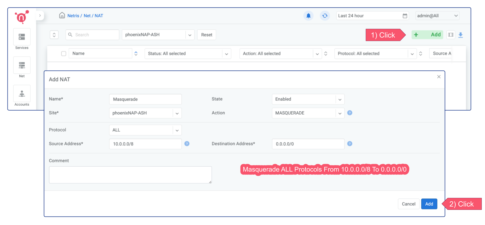
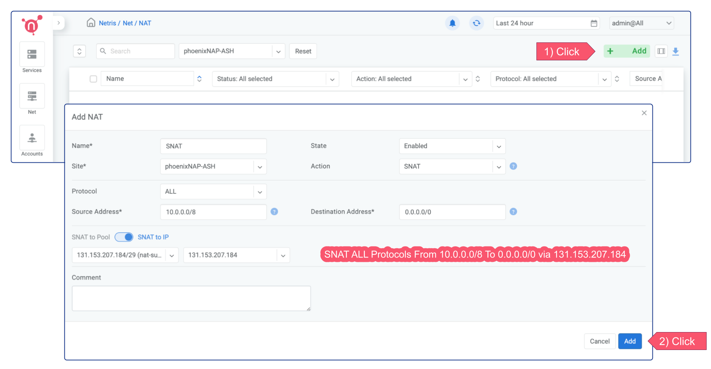
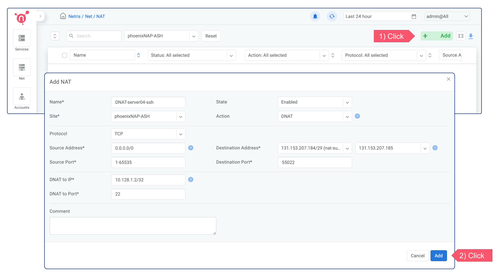

.. meta::
  :description: Using NAT services in phoenixNAP BMC

.. _phxnap_nat:

####################################
Using NAT services in phoenixNAP BMC
####################################

NAT, under Net --> NAT, is a Network Address Translation (NAT) service. Netris supports most of the standard rules for MASQUERADE, SNAT, and DNAT. In this scenario, I am enabling instances in a private network with a subnet of 10.0.0.0/8 to have access to services outside their VPC. The goal is to provide bare-metal servers/VMs with the capability to connect to the Internet through NAT for outbound access.

Option 1 - MASQUERADE
=====================

The MASQUERADE is ideal for situations where you want to allow your instances to access the Internet for essential activities like installing/updating software packages, downloading files, and other similar tasks. The MASQUERADE doesn't require having a subnet with the purpose of NAT. Instead, it leverages the main IP address of the active softgate to perform network address translation (NAT).

Option 2 - SNAT
===============

Unlike MASQUERADE, the SNAT requires having a dedicated subnet with a :ref:`NAT purpose<phxnap_services>`. SNAT replaces the source IP address of the instances with the IP address of the "SNAT to IP". Thus, you can be sure that instances originating from certain source IP addresses are consistently translated through the designated IP address. Therefore, SNAT is well-suited for scenarios where your production traffic flow requires the use of dedicated IP addresses for outbound connectivity.

You can always have more granular control either through NAT rule or using Services → ACLs.

DNAT
====

A DNAT (Destination Network Address Translation) allows incoming traffic to be redirected from a destination IP address and port to a  "DNAT to IP/Port". This type of rule is often used in scenarios where you want to forward incoming traffic to a specific server within your network, such as a web server or database.

I'm creating a DNAT rule for the ssh port in the example below. It forwards the public IP's 55022 port to the local IP's 22 port. Once the rule is applied, you can easily establish a remote SSH connection to the server.

