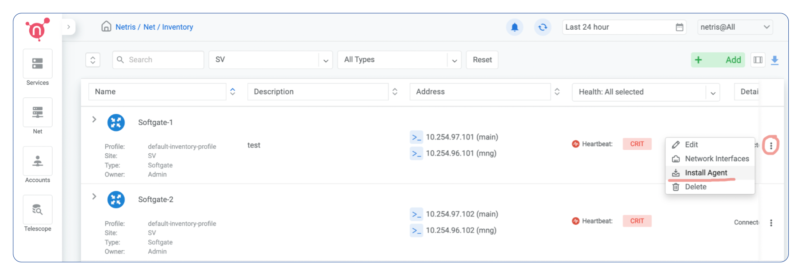

==============================
SoftGate software provisioning
==============================

#########################################
SoftGate PRO (100G) software provisioning
#########################################

SoftGate PRO is the high performance version that takes advantage of DPDK and SmartNIC technologies.

Check hardware requirements and BIOS configuration here.

**Install the Netris Agent**

A requirement for this setup is a newly installed Ubuntu Linux 20.04 LTS, along with internet connectivity through the management port configured using netplan.

1. Navigate to Network → Inventory.

Copy the one-liner displayed in the window and execute it as a regular user on the SoftGate.

2. Upon completing the installation, examine the ifupdown configuration file and ensure that the displayed configuration aligns with what you set up during the OS installation process (the file is generated based on your initial netplan configuration).

.. note::
  If the Netris Controller is not in the same OOB network, then add a route to the Netris Controller. No default route or other IP addresses should be configured."

.. code-block:: shell-session
  user@host:~$ sudo vim /etc/network/interfaces

.. code-block:: shell-session
  # The loopback network interface
auto lo
iface lo inet loopback

# The management network interface
auto ensZ
iface ensZ inet static
    address <Management IP address/prefix length>
# Please delete or comment out the line below if Netris Controller is located in the same network with the SoftGate node.
    up ip route add <Controller address> via <Management network gateway>
    gateway <Gateway IP address>

 source /etc/network/interfaces.d/*

If the Netris agent is able to reach the controller, please remove/comment the Gateway line and save the file. 

.. note::
  Please do not configure any additional IP addresses other than those described in the example above. The further configuration will be performed by the Netris agent.

3. Reboot the SoftGate.

.. code-block:: shell-session
  user@host:~$ sudo reboot

Once the server boots up you should see its heartbeat going from Critical to OK in Network → Inventory.

