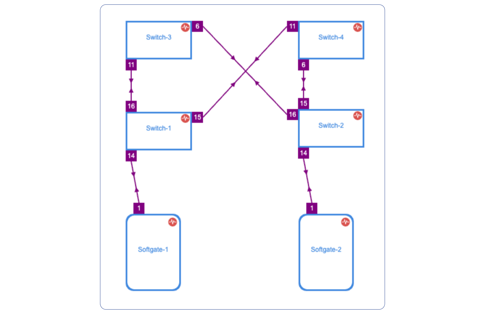

##############
Topology setup
##############

The topology manager is used for describing and monitoring the desired network topology. Netris software will configure the underlying network devices according to this topology dynamically and will watch against potential failures. Wire your switches in accordance with the topology view.

Right-click on the desired device and choose "Create Link". Select switch-ports for current and remote nodes.

Once the links have been defined, the network is automatically configured as long as physical connectivity is in place and Netris Agents can communicate with the Netris Controller.
