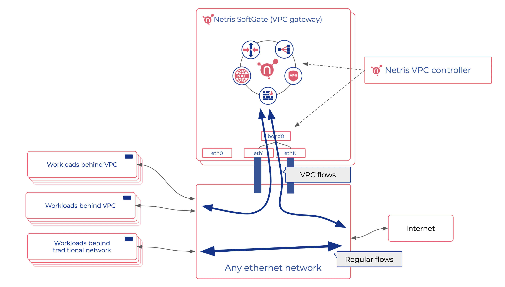

########################
VPC Anywhere Overview
########################

Introduction
-------------

VPC Anywhere is a solution designed by Netris that allows the integration of VPC network functionality into any network. Netris VPC can be used for all or part of the network traffic. Therefore it is easy to integrate Netris VPC even into existing production Networks without introducing disruptive procedures. 

Concept
---------

SoftGate is a highly optimized automatic Linux gateway that communicates with Netris VPC controller through an encrypted management link. 

A SoftGate node (typically two of them for redundancy) connects to the physical network on an 802.1q trunk port (similar to your Vmware or KVM hypervisors). 

Netris needs to know what VLAN IDs it is allowed to utilize. We recommend reserving a range of VLAN IDs dedicated to Netris VPC. Thus safely isolating VPC traffic flows from all other traffic flows that may exist on the network. 

SoftGate node becomes the default gateway for the workloads consuming the VPC network. Your existing switch network becomes a transport network for moving 802.1q tagged packets between SoftGate nodes and workload servers. 

