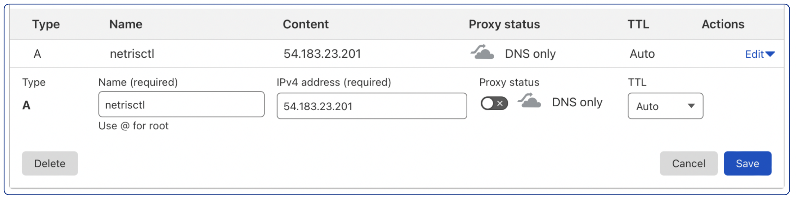

.. meta::
    :description: Installing a Netris Controller

==============================
Install a Netris Controller
==============================

Requirements and Installation steps
-----------------------------------

You can install the Netris controller almost on any 64-bit Linux host. Netris Controller may or may not be on the same network as the managed network nodes are. In fact, if there are multiple Netris managed deployments there's no need for an individual controller for each deployment.

It doesn't matter where to host the Netris controller. What does matter is that the Netris controller needs to be accessible over the Internet. 1) So you can access the web console. 2) Nodes that are going to be managed by Netris need to have access to the Netris controller through their management network interface. 

**Linux Host requirements**

* RAM: 8 GB
* CPU: 4 Cores
* Disk: 50GB
* OS: Linux 64-bit

**DNS record**

In my example, my host got a public IP address 54.183.23.201. While it is OK for users and nodes to refer to the Netris Controller through an IP address, we recommend using a DNS record (this way it will be easier to potentially move Netris Controller somewhere with a different IP address). 

Below is an example using Cloudflare DNS service. (same idea with any DNS software or service)

Ensure that the newly created domain name indeed resolves into the right IP address of the machine that you are going to install the Netris Controller.

.. code-block:: shell-session

   host netrisctl.netris.dev
   netrisctl.netris.dev has address 54.183.23.201

**Install Netris Controller software and dependencies**

.. code-block:: shell-session

  curl -sfL https://get.netris.io | sh -s -- --ctl-hostname netris.example.com --ctl-ssl-issuer letsencrypt
  
.. note::
  Netris Controller installer will stand up a K3S cluster and then will deploy Netris Controller on top of it using Helm Chart.  The “--ctl-ssl-issuer” will instruct the installer to generate a Let's Encrypt SSL certificate and the "--ctl-hostname" will hint for what domain name the certificate must be generated. That's why it is important to create the DNS record before this step. Detailed info here: `doc <https://www.netris.io/docs/en/stable/controller-k3s-installation.html>`_.

.. image:: images/netris-controller-installed.png
    :align: center

Once the installation process is finished you will be able to access your newly installed Netris Controller web console using netris/newNet0ps credentials.

Security Matters
----------------

**Change the default password**

Setting → My Account → Change Password

.. image:: images/change-password.png
    :align: center
    
**Add new admin user**

Accounts → Users → +Add

.. image:: images/create-new-admin-user.png
    :align: center
    
**Restrict incoming TCP requests to the list below:**

+----------+--------------------------------+
| TCP Port | Service                        |
+==========+================================+
| 22       | SSH                            |
+----------+--------------------------------+
| 80       | HTTP                           |
+----------+--------------------------------+
| 443      | Netris Web Console             |
+----------+--------------------------------+
| 2003     | Streaming Telemetry (Collectd) |
+----------+--------------------------------+
| 3033     | Netris Monitoring (Telescope)  |
+----------+--------------------------------+
| 50051    | Netris Agent (gRPC)            |
+----------+--------------------------------+

