.. meta::
  :description: Netris VPC anywhere upstream peering options

***********************************
Connecting VPC to upstream networks
***********************************

There are two connection options available for VPC anywhere. Please choose to use one of them.

Using a VLAN with public IP addresses (DMZ)
===========================================
Netris VPC can use a traditional subnet or VLAN with public IP addresses (a DMZ network) for upstream network peering. 

In this scenario, Upstream ISP provides a subnet with a default gateway to reach the Internet. Typically each SoftGate node will use an IP address from ISP's subnet and will use the default gateway provided by the ISP. It is possible to assign multiple IP addresses on SoftGate nodes enabling SoftGates to act as :ref:`"L3 Load Balancer"<l3lb_def>`, :ref:`"L4 Load Balancer"<l4lb_def>`, :ref:`"NAT functionality"<nat_def>`  (including 1 to 1 NAT).

**logical diagram**

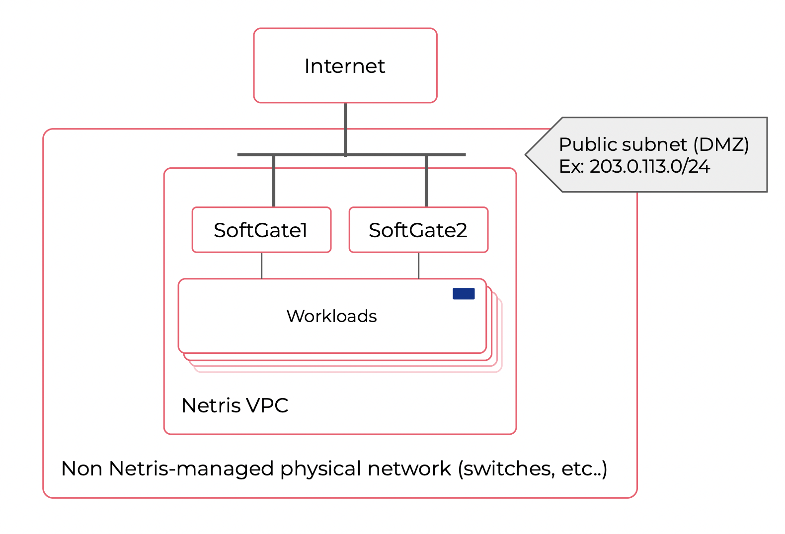

**physical diagram**

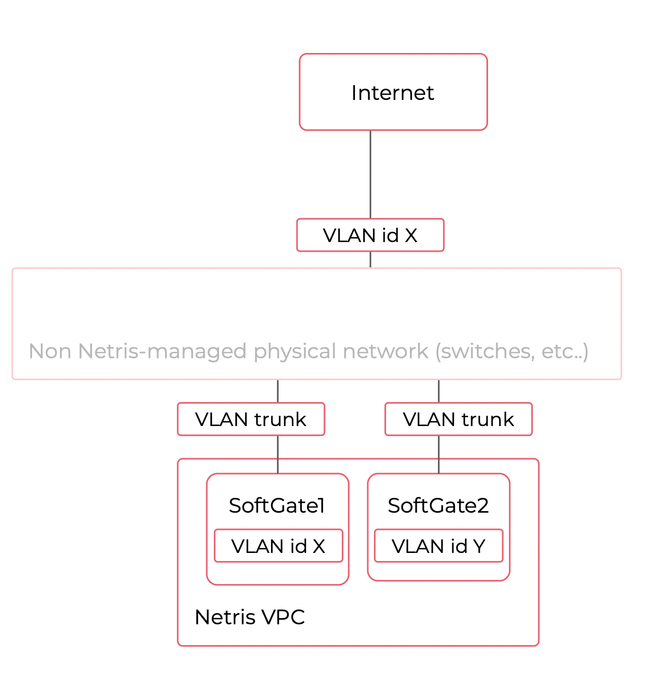

Traditional subnet: configuration
---------------------------------
| In this example we assume that the predefined default SoftGates are already installed and running according to :ref:`"SoftGate Installation"<softgate-installation-vpc_def>` tutorial.

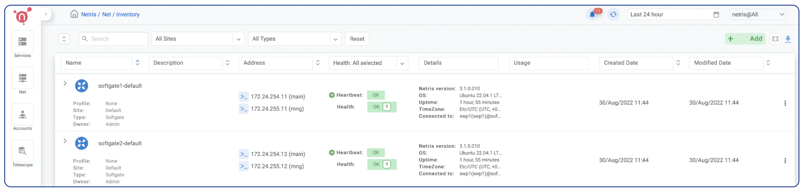

| The configuration starts from defining the subnet(s) required in Net->IPAM section, this process is documented in details in :ref:`"IP Address Management"<ipam_def>` section..

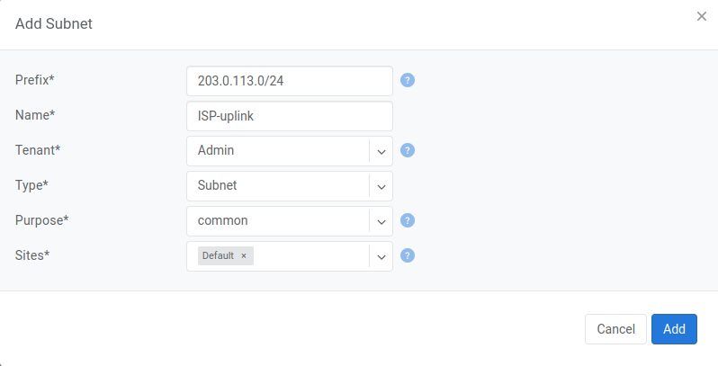

| Next, navigate to Services->V-Net section to create a new V-Net. Detailed description of fields can be found in :ref:`"V-Net"<v-net_def>`

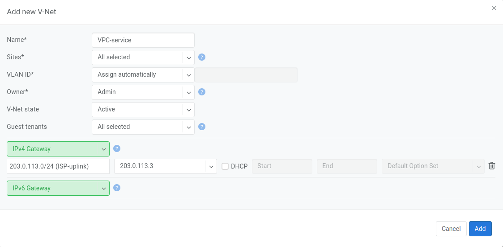

.. note:: 

    | The IP selection dropdown **is not** the default gateway IP address provided by ISP, the selected IP will be consumed by SoftGate.
    
    | Leaving **VLAN ID** field as *Assign automatically*  will use the next available VLAN ID from the pool defined in site attributes. Set this field to *Enter Manually* if you need to specify the VLAN ID.

| The final step is to add a default route object in the Net->Routes section 

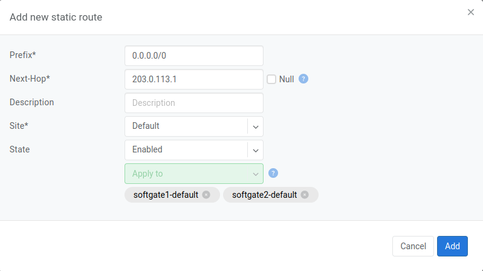

.. note:: 

    The IP address in the Next-Hop field is the default gateway IP address provided by ISP.

BGP Upstream
============
BGP Upstream: overview
----------------------
A BGP peering between Netris VPC and upstream routers is the most recommended option, especially for production use.

In this scenario, SoftGate nodes form BGP peering with upstream routers. Typically each BGP session will use an individual VLAN id and /30 subnet. Upstream BGP router should advertise the default route 0.0.0.0/0 or full Internet table if necessary. Netris SoftGate nodes are designed to handle over 1M routes in the routing table and can perform as border routers for the full-view table.
SoftGate nodes will automatically advertise public IP subnets in the current site as defined under the Net->IPAM section. Alternatively, you can optionally alter the default settings for full granular control over sent and received prefixes.

**Logical diagram**

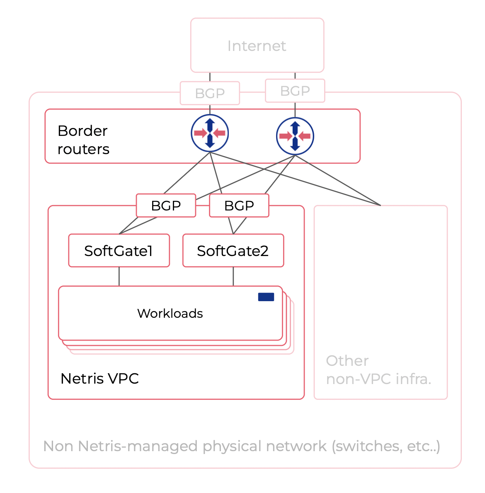

**Physical diagram**

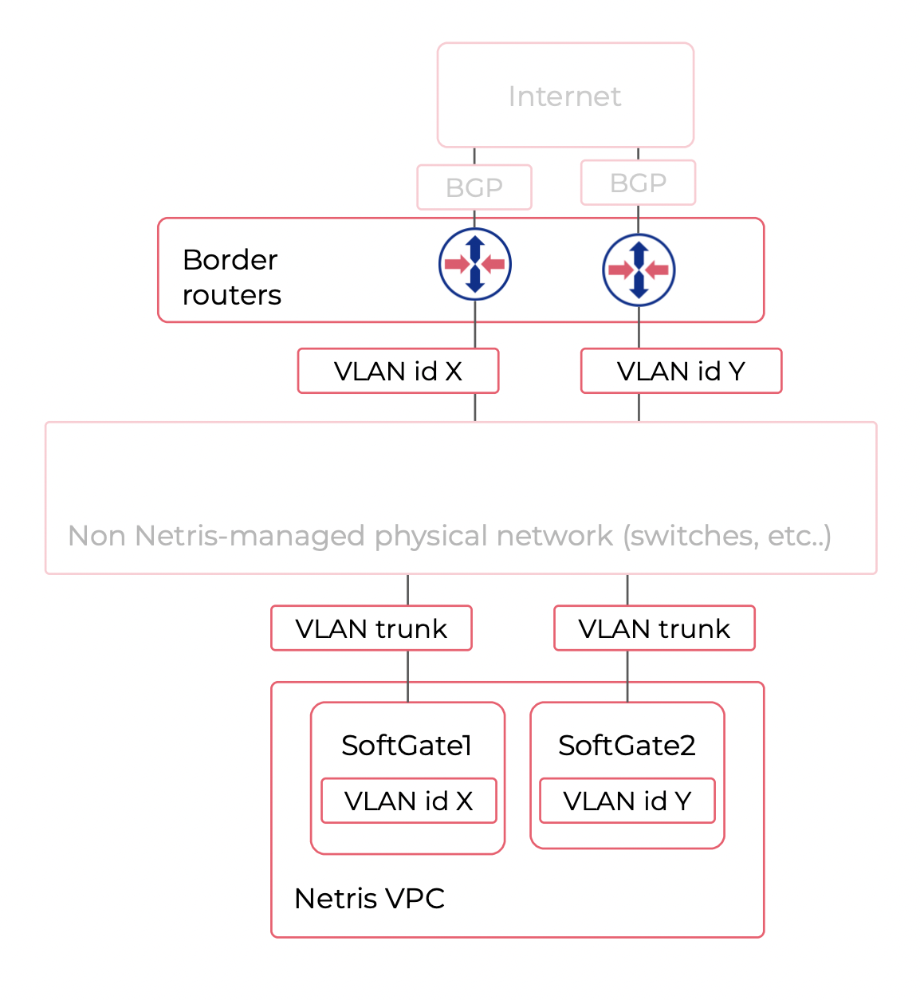

BGP Upstream: configuration
---------------------------

Your local public AS number is a site attribute located under the Net->Sites section. You can use the default private AS number or change to a real AS number depending on local network architecture needs.

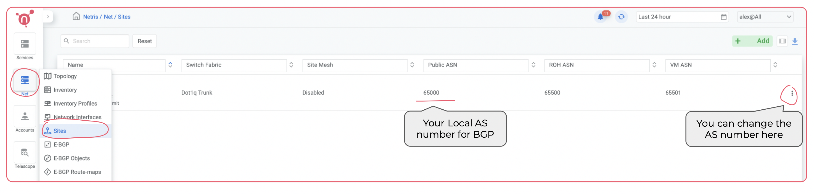

BGP peers can be defined under the Net->E-BGP section. 

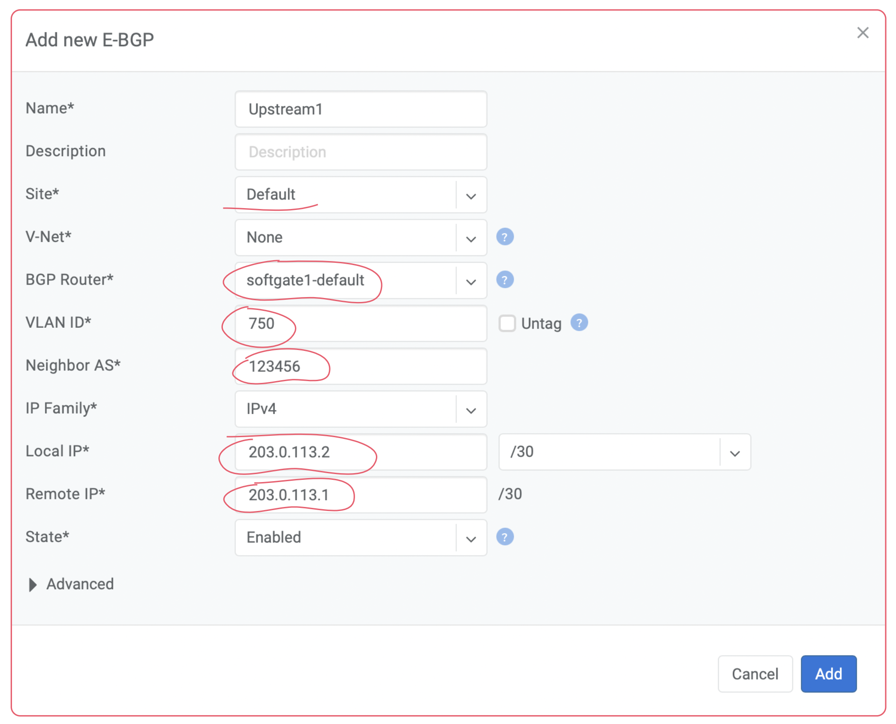

Check BGP neighbor statuses under the Net->E-BGP 

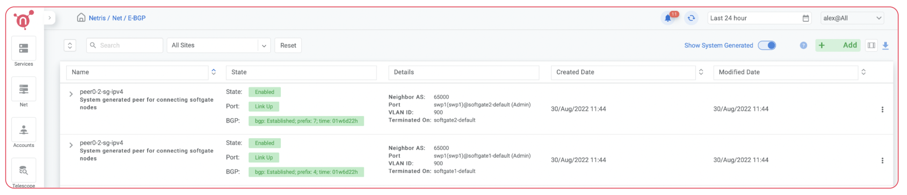

To check/troubleshoot BGP use Net->Looking Glass

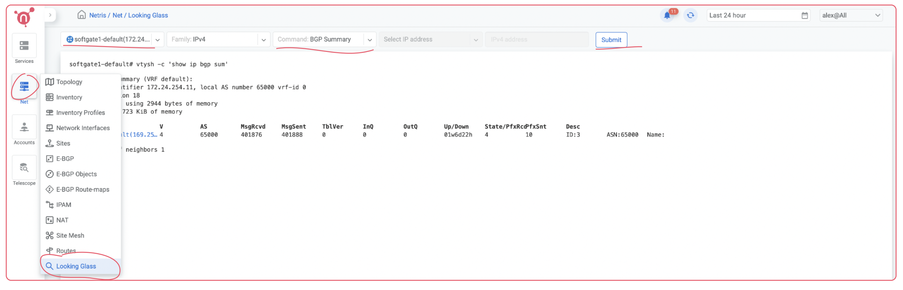

