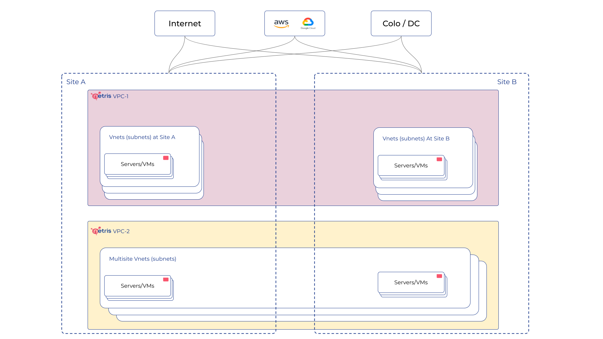
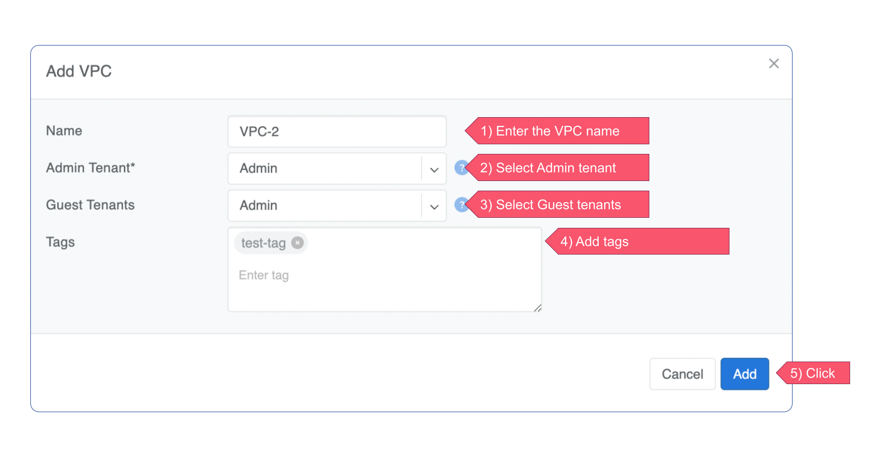

#########
VPC setup
#########

The Netris VPC offers you the ability to operate your resources within a logically segregated virtual network. You can create, edit, and remove VPCs as needed. The VPC acts as a VRF in traditional networking, providing the ability to employ overlapping IP ranges across various VPCs while maintaining secure management and operation of resources.

Netris Controller is preconfigured with a default system VPC-1. Use the default VPC, and create additional VPCs as needed in the future.

To create VPC go to Network → VPC → +Add

