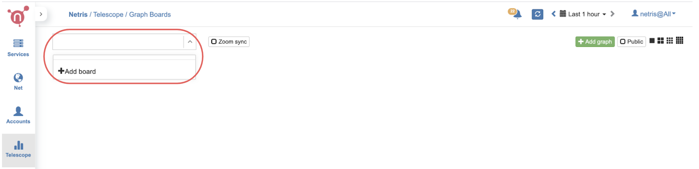
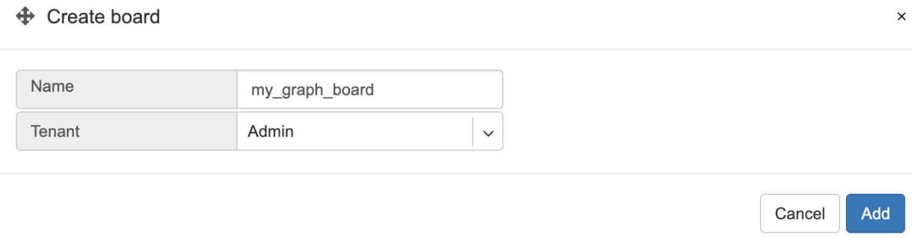

**********************
Visibility (Telescope)
**********************

Graph Boards
=================
You can create custom graph boards with data sources available in different parts of the system. You can even sum multiple graphs and visualize them in a single view.

To start with Graph Boards, first, you need to add a new Graph Board. 

1. Navigate to Telescope→Graph Boards, open the dropdown menu in the top left corner, then click +Add board.

    
2. Type a name and assign it to one of the tenants that you manage. Later on, you can optionally mark the Graph Board as public if you want the particular board to be visible to all users across multiple tenants.  

    
Now you can add graphs by clicking +Add graph. 
