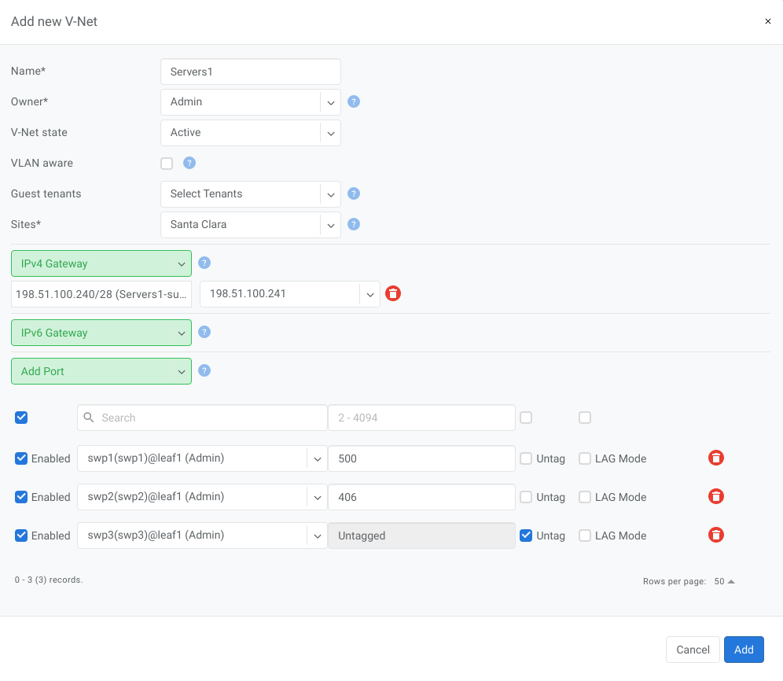

.. meta::
    :description: V-Net

#####
V-Net
#####
V-Net is a virtual networking service that provide a Layer-2 (unrouted) or Layer-3 (routed) virtual network segments on switch ports anywhere on the switch fabric. V-NETs can be created and managed by a single tenant (single team) or they can be created and managed collaboratively by multiple tenants (different teams inside and/or outside the organization).
Netris automatically configures a VXLAN with an EVPN control plane over an unnumbered BGP Layer-3 underlay network and organize the high availability for the default gateway behind the scenes.

V-Net Fields
============

- **Name** - Unique name for the V-Net
- **Owner** - Tenant, who can make any changes to current V-Net
- **V-Net state** - Active/Disable state for entire V-Net
- **VLAN aware** - Enable VLAN aware bridge, use only in rare cases, if otherwise is not possible
- **Guest tenants** - List of tenants allowed to add/edit/remove ports to the V-Net but not manage other parameters
- **Sites** - Ports from these sites will be allowed to participate in the V-Net. (Multi-site circuits would require backbone connectivity between sites).
- **IPv4 Gateway** - IPv4 address to be used as a default gateway in this V-Net. Should be configured under Net→IPAM as an assignment, assigned to the owner tenant, and available in the site where V-Net is intended to span.
- **IPv6 Gateway** - IPv6 address to be used as a default gateway in this V-Net. Should be configured under Net→IPAM as an assignment, assigned to the owner tenant, and available in the site or sites where V-Net is intended to span.
- **Port** - Physical Switch Port anywhere on the network. Switch Port should be assigned to the owner or guest tenant under Net→Switch Ports.
  
  - **Enabled** - Enable or disable individual Switch Port under current V-Net
  - **Port Name** - Switch Port format: <alias>(swp<number>)@<switch name>
  - **VLAN ID / Untag** - Specify a VLAN ID for tagging traffic on a per-port basis or set Untag not to use tagging on a particular port. VLAN tags are only significant on each port’s ingress/egress unless VLAN aware mode is used.
  - **LAG Mode** -  Allows for active-standby dual-homing, assuming LAG configuration on the remote end. Active/active dual homing will be enabled in future releases (dependence on SVI support by NOSes).

.. tip:: Many switches can’t autodetect old 1Gbps ports. If attaching hosts with 1Gbps ports to 10Gpbs switch ports, you’ll need to change the speed for a given Switch Port from Auto(default) to 1Gbps. You can edit a port in Net→Switch Ports individually or in bulk.

.. centered::
   Example: Adding a new V-Net.

.. image:: images/list-vnet.png
    :align: center
    :class: with-shadow

.. centered:: 
    Example: Listing of V-Nets.

.. image:: images/list-vnet-expanded.png
    :align: center
    :class: with-shadow

.. centered:: 
   Example: Expanded view of a V-Net listing.   