.. meta::
    :description: V-Net

.. _v-net_def:

=====
V-Net
=====

.. contents:: Table of Contents
   :local:
   :depth: 4

Introduction
----------------

A **V-Net (Virtual Network)** is a Netris construct for grouping switch ports into a defined network segment—much like a traditional VLAN or a public cloud subnet.

To build a V-Net you only need to supply **a list of switch ports**, **a name**, **parent** :doc:`VPC </vpc>`, **and site(s)**. Optionally IP subnet, gateway, and DHCP settings.

Netris, having already configured the EVPN underlay, then automatically pushes the entire under-the-hood V-Net configuration to every Ethernet switch and DPU in the fabric:

* **VLAN-to-VNI mapping**, when needed
* **Anycast gateway IP/MAC** on every leaf that hosts the V-Net, when a gateway is specified
* **Assign switch** ports to the appropriate VLANs or configure L3 physical/subinterfaces
* **Set MTU**
* Configure **custom LLDP TLVs**

Netris V-Net supports **two transport modes**:

* **L2VPN** (Layer 2 Virtual Private Network) is similar to a traditional VLAN with modern and scalable implementation. It is typically used for front-end (north-south) or management/out-of-band networks. Add a gateway, and it behaves like a VLAN with an SVI / IRB.

  L2VPN is implemented with VXLAN (Virtual Extensible LAN) transport and is a technology that enables the creation of Layer 2 switched overlays on top of a Layer 3 routed infrastructure. Often used in data centers to provide flexibility and scalability, VXLAN encapsulates Ethernet frames within UDP packets, enabling Layer 2 segments to span across a routed network.
  EVPN (Ethernet VPN) is a control plane protocol that works with VXLAN to distribute MAC address information and manage traffic to enable efficient and scalable Layer 2 connectivity.

* **L3VPN** is typically used for back-end (east–west) connectivity in GPU clusters on Ethernet-based AI fabrics such as NVIDIA Spectrum-X. Built as one mini-subnet per switch port, a VXLAN L3VPN is conceptually similar to MPLS L3VPN in provider networks.

  VXLAN L3VPN is implemented by extending VXLAN's overlay capabilities to support Layer 3 routing between different Layer 2 networks (VNIs). This is achieved by using an IP VRF and a Layer 3 VNI (VXLAN Network Identifier) within the VXLAN tunnel to forward routed traffic between VNIs. Essentially, VXLAN provides the encapsulation and tunneling, while EVPN (Ethernet VPN) distributes reachability information using BGP.

  Each switch port gets its own /31 IPv4 (`RFC 3021 <https://datatracker.ietf.org/doc/html/rfc3021>`_) or /127 IPv6 (`RFC 6164 <https://datatracker.ietf.org/doc/html/rfc6164>`_) address; the leaf’s address becomes the server’s default gateway. All of those “2 host” subnets are advertised inside the VPC's VRF, so every server can reach every other purely through routing—there is no shared Layer-2 broadcast domain.

L2VPN V-Nets
----------------
You can start creating a new V-Net by navigating to ``Services -> V-Net`` and clicking ``+Add`` in the top right.

Every V-Net must include:
  - Name of the V-Net,
  - VPC containing the V-Net,
  - Sites where V-Net is deployed,
  - VLAN ID (for L2VPN V-Nets), which Netris will assign when set to Automatic,
  - Owner administering the V-Net,
  - V-Net state,
  - List of switch ports to include in the V-Net, which can be explicitly listed or referenced through :ref:`Labels <tags>`.

Optionally V-Net definition can also include:
  - :ref:`Labels <tags>` for dynamic switch port inclusion into the V-Net,
  - List of collaborators (Guest tenants) who can add or remove switch ports to and from the V-Net, but not edit any other properties of the V-Net,
  - IPv4 or IPv6 Gateway (for L2VPN V-Nets) to make the V-Net routable inside the VPC, i.e., add an SVI to the VLAN,
  - DHCP scope and option set (for L2VPN V-Nets),
  - Anycast MAC address (for L2VPN V-Nets), which Netris can assign for you.

.. image:: images/vnet-example.png
    :alt: Example V-Net configuration
    :align: center
    :class: with-shadow

DHCP
^^^^^^^^^^^^^^^^^^^^^^^^
L2VPN routed V-Nets (where an IP gateway is added) may also be configured with a DHCP service fully managed by Netris and hosted on SoftGate.

You can configure additional DHCP Option Sets before enabling a DHCP server for any V-Net. Add a DHCP Options Set by navigating to ``Services -> DHCP Options Sets`` and clicking ``+Add`` in the top right.

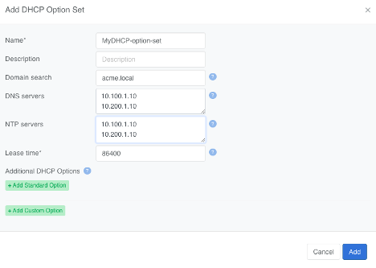

.. raw:: html

   

Netris supports a wide range of Standard DHCP Options.

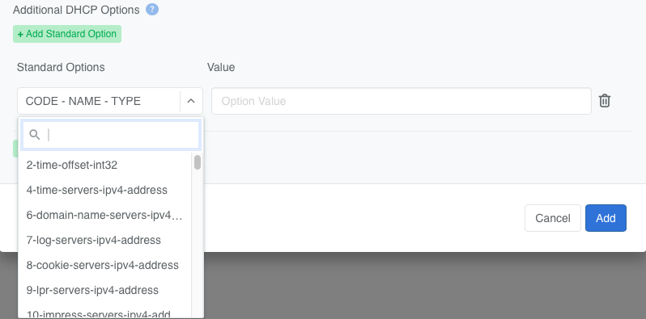

.. raw:: html

   

Netris also enables you to define Custom DHCP Options.

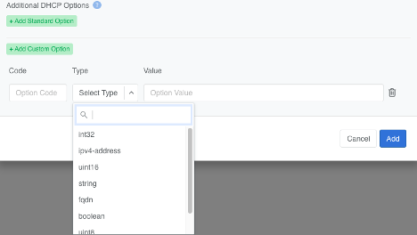

.. raw:: html

   

DHCP Relay
^^^^^^^^^^^^^^^^^^^^^^^^
Netris supports using an external DHCP server (outside of Netris) by enabling the DHCP Relay function. This allows DHCP clients inside a V-Net to obtain addresses from a non-Netris-managed DHCP server running in the same or another VPC.

To configure DHCP Relay in a V-Net:
 - Specify the VPC where the DHCP server is located.
 - Enter the IP addresses of the primary and (optionally) backup DHCP servers.
  
.. tip::
  In a VPC a DHCP Relay service and a DHCP service cannot be enabled simultaneously.

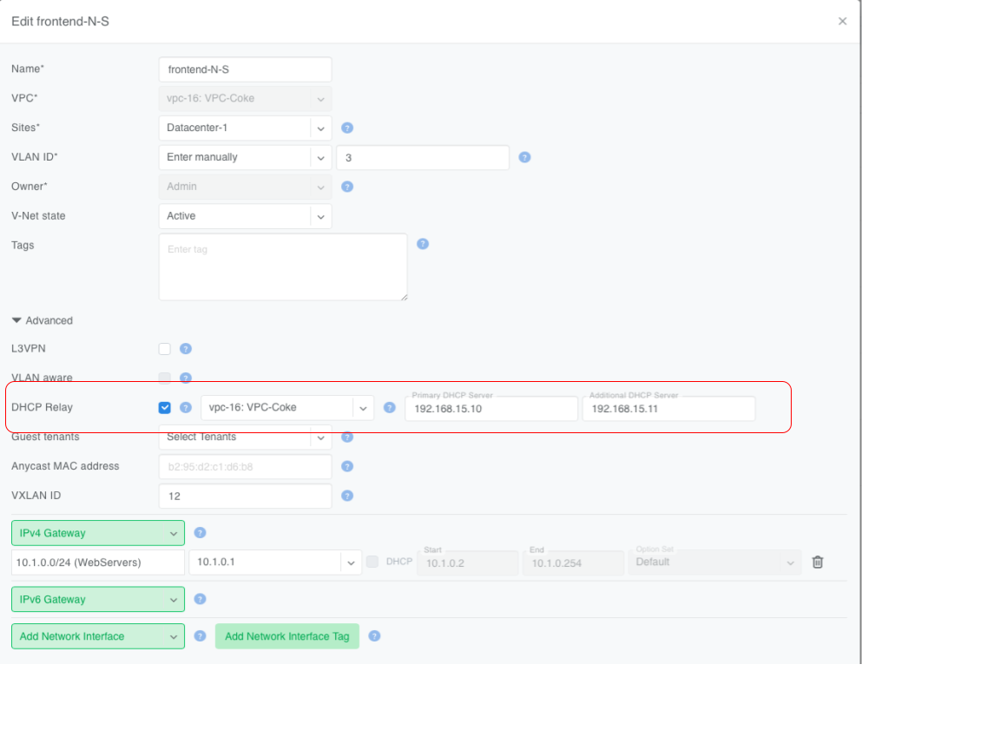

.. raw:: html

     

.. note::
  * VPC peering is mandatory on Cumulus Linux fabrics. Without it, relay traffic cannot reach the DHCP server. Configure peering under Network → VPC Peering in the Controller.
  * Non-overlapping IP ranges are required between the client VPCs (Coke and Pepsi) and the DHCP server’s VPC (Shared). The DHCP server must be able to route back to both Coke and Pepsi.
  * Switch loopback IP is the source IP of relayed packets

.. raw:: html

   

Example:
""""""""

Suppose you have tenant workloads in VPC Coke and VPC Pepsi. Both need DHCP, but you want to run a single DHCP service in VPC Shared.

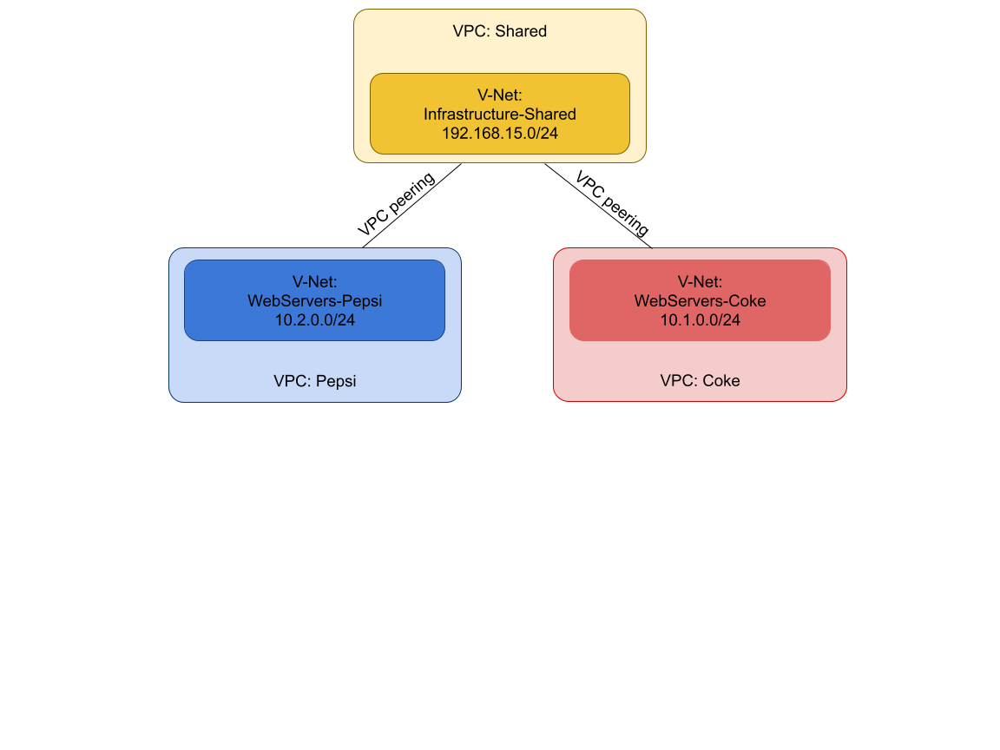

.. raw:: html

   

1. In each tenant’s V-Net (Coke and Pepsi), enable DHCP Relay and set the DHCP server address to the IPs of the DHCP servers in VPC Shared.

  .. image:: images/dhcp-relay-coke.png
      :alt: DHCP Relay
      :align: center
      :class: with-shadow

  .. raw:: html

     

  .. image:: images/dhcp-relay-pepsi.png
      :alt: DHCP Relay
      :align: center
      :class: with-shadow

  .. raw:: html

     

  .. image:: images/dhcp-relay-shared.png
      :alt: DHCP Relay
      :align: center
      :class: with-shadow

  .. raw:: html

     

2. Establish VPC peering between Coke ↔ Shared and Pepsi ↔ Shared.

  .. image:: images/dhcp-relay-vpc-peer-coke.png
      :alt: DHCP Relay
      :align: center
      :class: with-shadow

  .. raw:: html

     

  .. image:: images/dhcp-relay-vpc-peer-pepsi.png
      :alt: DHCP Relay
      :align: center
      :class: with-shadow

  .. raw:: html

     

Now:
 - DHCP clients in the tenant VPC (Coke and Pepsi) broadcast their DHCP requests normally in their respective V-Nets
 - Netris configures the fabric to forward these requests across the peering link to the DHCP server in the shared VPC.

V-Net Fields explained
^^^^^^^^^^^^^^^^^^^^^^^^

.. list-table::
   :header-rows: 1

   * - **Field**
     - What it does
     - Notes / defaults
   * - **Name**
     - Unique name for the V-Net.
     - Must be globally unique.
   * - **VPC** (Virtual Private Cloud)
     - Construct that contains the V-Net.
     - A VPC must exist first.
   * - **Sites**
     - One or more sites where the V-Net will run.
     - Sites must belong to the chosen VPC. Multi-site V-Nets would require backbone connectivity between sites.
   * - **VLAN ID**
     - • **Assign Automatically** – controller picks the next free VLAN ID.
       • **Enter Manually** – you type the VLAN ID.
       • **Disabled** – VXLAN only (no 802.1Q).
     - Always visible. When L3VPN is enabled this field is auto-set to Disabled and cannot be changed.
   * - **Owner**
     - User group with full edit rights.
     - Can change any setting: name, VLANs, gateways, DHCP, tags, and so on
   * - **V-Net state**
     - **Active** or **Disabled**.
     - Disabled = config withdrawn from switches.
   * - **Tags**
     - Free-form labels for search/filter.
     - Example: prod, gpu, east-1.
   * - **Add Network Interface**
     - Explicitly attach switch ports to the V-Net.
     - Use when exact ports are known. Switch Port should be assigned to the owner or collaborator under ``Network -> Network`` Interfaces
   * - **Add Network Interface Tag**
     - Attach ports by label.
     - Useful for large server fleets.
   * - **Untagged**
     - Set port to untagged mode. Triggers whether traffic should be sent VLAN tagged (trunk mode) or VLAN untagged (access mode) for this switch port.
     - VLAN tags are only significant on each port’s ingress/egress unless VLAN aware mode is used.

Advanced V-Net Fields explained
^^^^^^^^^^^^^^^^^^^^^^^^^^^^^^^^
.. list-table::
   :header-rows: 1

   * - **Field**
     - What it does
     - When it appears
   * - **L3VPN**
     - Puts the V-Net in Layer-3 mode: Netris assigns each switch port a /31 and sets the leaf’s IP as the host’s gateway.
     - Ethernet fabrics only. Enabling L3VPN forces VLAN ID = Disabled.
   * - **VLAN-aware**
     - Lets one V-Net carry multiple VLAN tags inside a single VXLAN ID. Think of this like Q-in-Q, but it’s Q-in-VxLAN.
     - Requires switches that support VLAN-aware bridging.
   * - **Guest Tenants** (Collaborators)
     - Admin units that may add/remove switch ports but cannot change core settings.
     - Optional; owner always retains full control.
   * - **Anycast MAC address**
     - Overrides the auto-generated anycast MAC.
     - Leave blank to use the default.
   * - **VXLAN ID**
     - VXLAN Network Identifier (1 – 16777216).
     - Auto-assigned unless you enter a value.
   * - **IPv4 Gateway / IPv6 Gateway**
     - Anycast gateway IPs for Layer-3-enabled L2VPN.
     - Hidden when L3VPN is on. Leave blank for pure Layer-2 V-Net. Must be configured under ``Network -> IPAM`` as a subnet with purpose set to ``common``, assigned to the Owner, and available in the site where V-Net is intended to span.

.. warning::
    Many switches cannot autodetect 1Gbps link speed. If attaching hosts with 1Gbps NICs to 10Gbps switch ports, set the speed for the given Switch Port from Auto(default) to 1Gbps. You can edit a port in ``Network -> Network Interfaces`` individually or in bulk.

Multisite V-Nets
^^^^^^^^^^^^^^^^^^^^^^^^
Any V-Net may span multiple sites. If the V-Net spans multiple sites and you add a gateway, you must first create the subnet under ``Network -> Subnets`` and assign it to all sites the V-Net will span (You can define additional sites in ``Network -> Sites``). This way the anycast IP is valid everywhere.

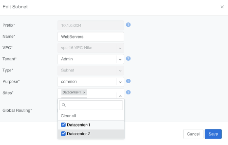

.. raw:: html

   

Link Aggregation and Multihoming
^^^^^^^^^^^^^^^^^^^^^^^^^^^^^^^^^^^^^^^^^^^^^^^^
**Link Aggregation (LAG)**, also known as link bundling, Ethernet/network/NIC bonding, or port teaming, is a method of combining (aggregating) multiple network interfaces to increase throughput beyond what a single switch port could provide and/or provide redundancy in case one of the links fails.

An endpoint may be connected to a single switch with multiple cables, which are aggregated into a single logical bonded interface. This is known as single-homing.

An endpoint may be connected to two or more switches simultaneously, with these connections aggregated into a single logical bonded interface. Often done to eliminate single points of hardware failure, this method is known as multi-homing.

.. image:: images/lag_diagram.png
    :align: center
    :alt: LAG diagram

For best results, Netris recommends enabling **Link Aggregation Control Protocol (LACP/802.3ad)** when configuring server-side bonding.

Netris fully supports both single-home and multi-home use cases, and for multi-home use cases, Netris supports EVPN-MH and MC-LAG, subject to switch hardware support.

* **EVPN-MH** (recommended by Netris) is a standardized way to multi-home a device. It uses BGP EVPN with Ethernet Segment Identifiers (ESI) for control plane and Designated Forwarder (DF) election to avoid loops. EVPN-MH works with VXLAN overlays, supports all-active and single-active configurations, and offers quick convergence via aliasing and multi-homing.
* **MC-LAG** (or MLAG) is a switch vendor feature that extends LACP across two switches, avoiding loops with a shared control domain. It requires ICCP (Inter-Chassis Control Protocol), one or more peer-links, and typically scales to two devices, providing active-active L2 forwarding. Convergence and scaling are limited compared to EVPN-MH

Ethernet VPN Multi-Homing (EVPN-MH)
""""""""""""""""""""""""""""""""""""
**Ethernet VPN Multi-Homing** (EVPN-MH) is a standards-based network feature that allows a single endpoint to connect to two or more switches for redundancy and load sharing. This setup ensures that if one switch or link fails, traffic can continue to flow through the remaining connections without needing to reconfigure the network.

You can configure EVPN-MH in Netris in one of two ways: **Automatic Link Aggregation** or **Server Object custom JSON**.

Automatic Link Aggregation
~~~~~~~~~~~~~~~~~~~~~~~~~~

**Automatic Link Aggregation** is a Netris feature that allows Netris to automatically create a bond interface for each switch port that is added to a V-Net. This prepares the network side to support bonded server connections without requiring manual configuration in the controller or switch port downtime.

The behavior of the bond is determined entirely by the **server-side configuration**. This gives the server administrator direct control over bonding behavior, enabling adjustments without waiting for network team changes, and allowing deployments to be adapted quickly and efficiently.

* Active/Standby (no LACP): The bonded links function for basic redundancy. Traffic fails over if one link goes down, but only one link is active at a time.
* Active/Active with LACP: If the server bond uses LACP, Netris detects the LACP negotiation and automatically determines which switches and switch ports the member links connect to. It then configures EVPN-MH on those switches and ports, allowing the server to take advantage of multi-homing with active/active load sharing and fault tolerance.

To enable Automatic Link Aggregation
  * Navigate to ``Network -> Inventory Profiles``.
  * Edit the Inventory Profile assigned to relevant switches and enable the ``Automatic Link Aggregation`` checkbox.

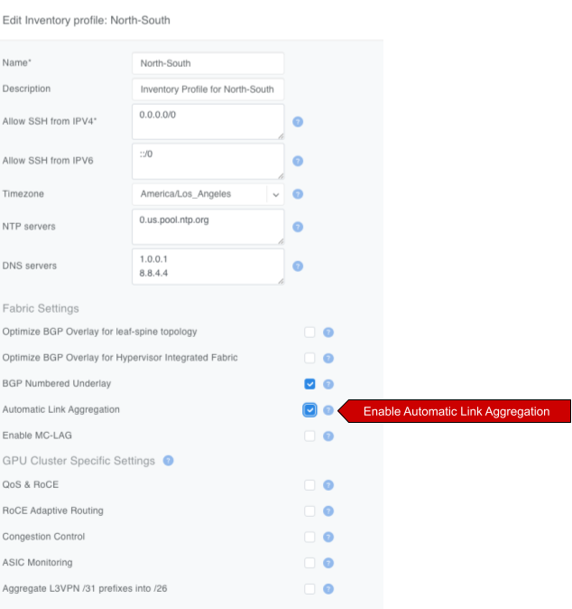

.. raw:: html

   

Server object custom JSON
~~~~~~~~~~~~~~~~~~~~~~~~~~
Server Object Custom JSON method enables you to exercise granular control over which endpoints get a bond interface.

In a server object definition, Netris supports the use of optional JSON snippets to describe how server NICs are grouped. When you include such a snippet to declare NICs as part of a bond, this serves as a signal to Netris to place the corresponding switch ports into a bond. Just like with the Automatic Link Aggregation method, the server administrator retains full control over the bond behavior, including whether the bond operates in active/standby or active/active mode.

.. image:: images/server-custom-json.png
   :align: center
   :alt: Server Object with custom JSON defining a bond interface
   :class: with-shadow

.. raw:: html

   

.. code-block:: json
    :caption: Example JSON snippet defining a bond interface

    {
        "network": {
            "eth9": {
                "slave": "bond0",
                "mtu": 9216
            },
            "eth10": {
                "slave": "bond0",
                "mtu": 9216
            }
        }
    }

.. warning::
    The JSON method and Automatic Link Aggregation serve the same purpose. If Automatic Link Aggregation is turned on, any JSON entries are ignored.

MC-LAG
"""""""""""""""""""""""
**Mult-chassis Link Aggregation** (MC-LAG) is a switch vendor's proprietary link aggregation method available to you and supported by Netris. Please check our :ref:`Overlay Network Functions <overlay-network-functions>` to verify which switches support this functionality.

In contrast to EVPN-MH, when using MC-LAG, users are expected to manually define the aggregation interfaces in the Netris controller and explicitly specify the switch ports to be added as bond members.

Additionally, you must add the aggregation interfaces (aggX) to the V-Net instead of the individual switch ports (swpX), like you would in EVPN-MH.

.. warning::
    MC-LAG requires the use of peer-link.

Enable MC-LAG in the inventory profile
~~~~~~~~~~~~~~~~~~~~~~~~~~~~~~~~~~~~~~~
You must enable MC-LAG support in the Inventory Profile that is assigned to the switch fabric.

To enable MC-LAG support:
  - Navigate to ``Network -> Inventory Profiles``.
  - Edit the Inventory Profile that is applied to the appropriate switches and set the checkbox for ``Enable MC-LAG``.

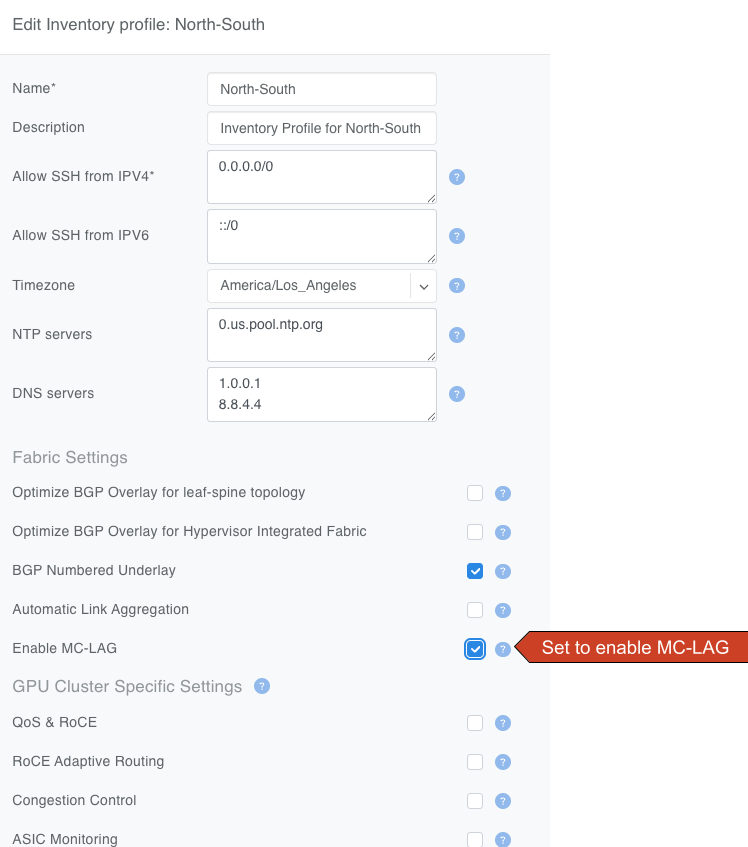

.. raw:: html

     

.. warning::
    When you enable MC-LAG functionality, Netris will automatically disable EVPN-MH support. These two features are mutually exclusive in a given fabric.

Configure MC-LAG Peer Link(s)
~~~~~~~~~~~~~~~~~~~~~~~~~~~~~~~~~~~~~~~
MC-LAG requires the presence of a physical peer link between the two switches participating in an MC-LAG configuration. Netris recommends multiple peer links for redundancy.

To define a peer link in Topology Manager
  - Navigate to ``Network -> Topology``.
  - Right-click one of the switches you will use in the MC-LAG pair.
  - Select ``Create Link``.
  - In the *Create Link* dialog box, select the other switch in the MC-LAG pair in the *To Device* drop-down.
  - Set the ``MC-LAG Peer Link`` check box.
  - ENter the shared MC-LAG IPv4 address and MC-LAG anycast MAC address.

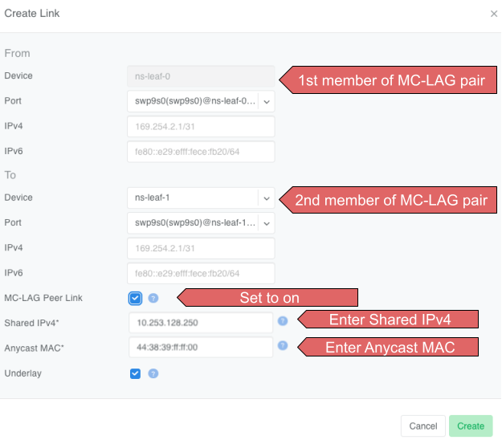

.. raw:: html

     

.. important::
    - Multiple MC-LAG peer links between the same pair of switches must have the same MC-LAG IPv4 and MAC addresses.
    - The MC-LAG shared IPv4 address must be a part of any IPAM-defined subnet with the purpose set to loopback.
    - For MC-LAG anycast MAC address, Netris recommends choosing any MAC address from  44:38:39:ff:00:00 - 44:38:39:ff:ff:ff range. The MAC address should be globally unique compared to other links in the Netris controller, except when other links are between the same pair of switches.

Create MC-LAG aggregation interfaces
~~~~~~~~~~~~~~~~~~~~~~~~~~~~~~~~~~~~~~~
Navigate to ``Network -> Network Interfaces``, select one or more switch ports, use the bulk action menu, and select ``Add to LAG``.

.. image:: images/interfaces-bulk-action-add-to-lag.png
    :align: center
    :alt: Bulk action menu with Add to LAG option
    :class: with-shadow

.. raw:: html

     

Click the ``ADD`` button and fill out other values as needed.

.. image:: images/add-to-LAG.png
    :align: center
    :alt: Add to LAG dialog
    :class: with-shadow

.. raw:: html

     

You must set ``MC-LAG`` to *Enabled* and manually enter ``MC-LAG ID`` for Netris to configure the bond as MC-LAG instead of single switch LAG or EVPN-MH.

.. tip::
    The MC-LAG ID value is locally significant to the switch pair.

You can now add these new *aggX* interfaces to V-Nets the same way you normally add switch ports.

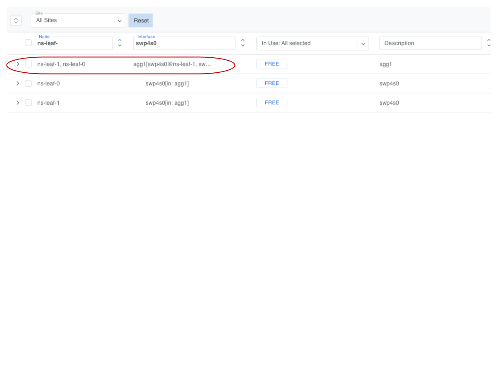

.. raw:: html

     

.. _tags:

Labels
^^^^^^
Labels (sometimes called tags) can be used to automatically place hundreds of switch ports into a V-Net. They can work together with the :doc:`Server Cluster </server-cluster>` and manual methods, or they can replace those methods.

Because Netris knows the topology, When you label server NICs, Netris can automatically identify the connected switch ports and place them into the V-Net.

How labels work
""""""""""""""""

When defining a server object in ``Network -> Inventory`` or ``Network -> Topology``, use the *Labels* section to label each NIC on the server using the following key/value syntax.

.. code-block::

    iface.eth1 = prod
    iface.eth2 = prod
    iface.eth3 = storage
    iface.eth4 = storage

.. tip::
    The hard-coded prefix *iface*. is required; it tells Netris the label applies to that specific NIC, not the whole server.

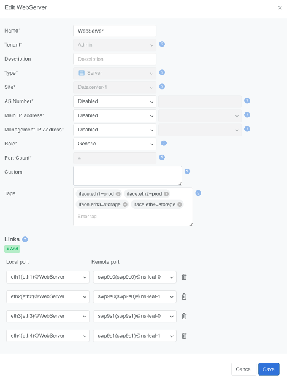

.. raw:: html

     

To automatically add switch ports to a V-Net based on a label, in the V-net definition dialog:
  - Click the ``Add Network Interface Label`` button.
  - Enter the “value” portion of the label. E.g., *storage* is the value of *iface.eth3=storage* label.
  - Specify whether you want the switch port to be 802.1q tagged or untagged.

Based on the links defined in the Topology, Netris finds the switch ports eth1 and eth2 are connected to and adds them to the V-Net.

.. image:: images/add-vnet-interface-based-on-label.png
    :align: center
    :alt: Add Network Interface Label dialog
    :class: with-shadow

.. raw:: html

     

Rules and limits
"""""""""""""""""""""

- If a port is added both directly and by label, the direct entry wins even if you remove the label from the server NIC.
- The same NIC can be untagged in only one V-Net.
- Switch ports used for underlay links are ignored.
- Works only on server objects with switch-to-server links defined.
- Labels can only be used to add switch ports to a VLAN-unaware L2VPN V-Nets. L3VPN and VLAN-aware L2VPN are not supported.

When to use labels
""""""""""""""""""
Labels can be used on their own or together with :doc:`Server Cluster </server-cluster>`.

Imagine a multi-tenant cloud operator manages hundreds of GPU servers, each with 11 network interfaces (a very typical situation): 8 interfaces for east-west traffic, 2 interfaces for north-south, and the last one for management.

The operator wants to be able to dynamically assign servers to different tenants, which means NICs *eth1* through *eth10* must be placed into the correct tenant’s VPC.

At the same time, the operator wants to keep the server’s IPMI / ILO / iDrac interface eth11 in the management VPC regardless of which tenant the server is reassigned to.

To achieve this outcome, the cloud operator can

    - Define a Server Cluster Template and only include non-management server NICs (*eth1* through *eth10*) in the template.

      .. code-block:: json

        [
            {
                "postfix": "East-West",
                "type": "l3vpn",
                "vlan": "untagged",
                "vlanID": "auto",
                "serverNics": [
                    "eth1",
                    "eth2",
                    "eth3",
                    "eth4",
                    "eth5",
                    "eth6",
                    "eth7",
                    "eth8"
                ]
            },
            {
                "postfix": "North-South-in-band-and-storage",
                "type": "l2vpn",
                "vlan": "untagged",
                "vlanID": "auto",
                "serverNics": [
                    "eth9",
                    "eth10"
                ],
                "ipv4Gateway": "192.168.7.254/21"
            }
        ]

    .. image:: images/GPU-cluster-template.png
        :align: center
        :alt: GPU Cluster Template
        :class: with-shadow

    .. raw:: html

         

    - Label the IPMI (*eth11*) NIC rather than include it in the Server Cluster Template.

    .. figure:: images/label-eth11-ipmi.png
        :align: center
        :alt: Label eth11 for IPMI
        :class: with-shadow

        The operator adds a *iface.eth11=ipmi* label to each server object for *eth11*

    .. raw:: html

         

    - Create a V-Net that includes this label as described earlier.

    .. figure:: images/create-vnet-label-ipmi.png
        :align: center
        :alt: Create V-Net for IPMI label
        :class: with-shadow

        The operator creates a V-Net for the management interfaces and adds network interfaces matching the *ipmi* label value.
    
    .. raw:: html

         

As a result of this configuration, Netris automatically adds *eth11* into the “Management” V-Net.

When a Server Cluster is created referencing the *GPU-cluster-template*, Netris will:

  - Keep *eth11* in the Management V-Net (notice in this example the V-Net is in the Default VPC).
  - Create new *East-West* and *North-South-in-band-and-storage* V-Nets in the VPCs selected when defining the Server Cluster. See :doc:`Server Cluster documentation </server-cluster>` for more details about creating Server Clusters.
  - Place *eth1* through *eth10* into the tenant’s V-Nets as specified in the template, even though the V-Nets are in a different VPC from the Management V-Net.

When the operator needs to reallocate the GPU servers to a different tenant, they simply reassign these servers to a different tenant’s Server Cluster. Netris will reconfigure the appropriate switch ports on the appropriate switches, but will keep the *eth11* in the Management V-Net.

L3VPN
-----------------

L3VPNs are typically used for back-end (east–west) connectivity in GPU clusters on Ethernet-based AI fabrics such as NVIDIA Spectrum-X.

L3VPN turns every switch port in the V-Net into its own **/31 IPv4 (or /127 IPv6) routed link** to the server. There is **no fabric-wide broadcast domain**; all traffic is routed from the first hop. The leaf-side switch port IP is the server’s gateway.

This method is commonly used on rail-optimized AI fabrics where each server NIC is dedicated to a GPU and has an individual /31 IP. Thorough planning of the IP schema and server-side routing configuration is required for this to function. Contact Netris for more details.

Netris still moves packets over VXLAN and advertises the /31 prefixes with EVPN, giving you VRF-style isolation without MPLS.

Creating an L3VPN V-Net
^^^^^^^^^^^^^^^^^^^^^^^^

L3VPN V-Nets require you to provide much the same information as the L2VPN V-Nets, such as **a name, parent VPC, site(s), and a list of switch ports**, but with a few key differences.

    1. **Set the L3VPN checkbox**.

      - The **VLAN ID** field locks to **Disabled**.
      - Gateway and DHCP options disappear—routing is handled on the /31 links.
      - Anycast MAC address is ignored.

    2. **Add switch ports** (directly, by label) and, per port:

      - **Untagged** – makes the port an access interface.
      - **VLAN ID** – optional; enter a tag to create a routed sub-interface instead.
      - **IPv4 / IPv6** – optional; leave blank to let Netris auto-allocate the /31 or a /127 pair.

.. warning::
    Typically /31s get assigned to links with Terraform during the onboarding phase.

.. image:: images/vnet-l3vpn-set.png
    :align: center
    :class: with-shadow
    :alt: L3VPN V-Net configuration

.. raw:: html

     

Behind the scenes, Netris

  #. Reserves or accepts a VXLAN ID for the V-Net.
  #. Creates a routed interface (or sub-interface if you set a VLAN ID) for each selected port.
  #. Assigns a /31 IPv4 (and /127 IPv6 if enabled) to every appropriate port on every appropriate switch.
  #. Advertises every /31 with EVPN route-type 5 so other leaves learn the host prefixes without flooding.

Rules and limits
^^^^^^^^^^^^^^^^^^^^^^^^
  - VLAN-aware mode is not available with L3VPN.
  - DHCP and anycast gateway are intentionally disabled; each server must configure its own IP on the peer side of the /31.
  - The Untagged toggle and per-port VLAN ID apply only to the interface you are adding; they never create a global broadcast domain.

With these steps you have a routed, broadcast-free V-Net ready for high-scale east–west traffic.

In larger fabrics Netris recommends turning on the optional /26 aggregation in the Inventory Profile (``Network -> Inventory Profiles``) to reduce TCAM usage in the hardware.

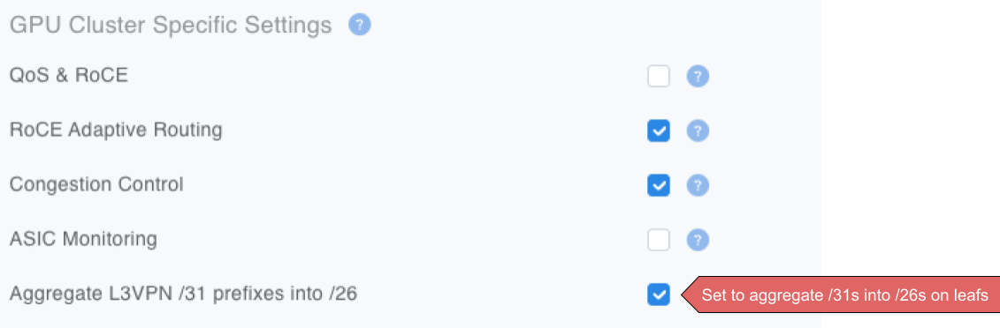

.. raw:: html

     

Verification Tools
------------------

UI Tools
^^^^^^^^^^

You can view all existing V-Nets by navigating to  ``Services -> V-Net``.

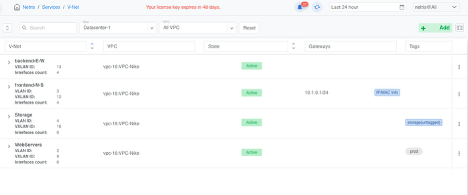

.. raw:: html

     

You can view additional operational details of any V-Net by clicking on the chevron to the left of the V-Net name to expand the view.

.. image:: images/vnet-list-expand.png
    :align: center
    :class: with-shadow
    :alt: Expanded V-Net list

.. raw:: html

     
