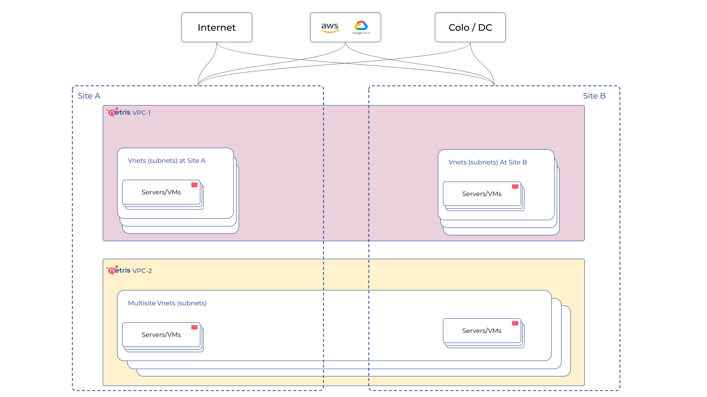
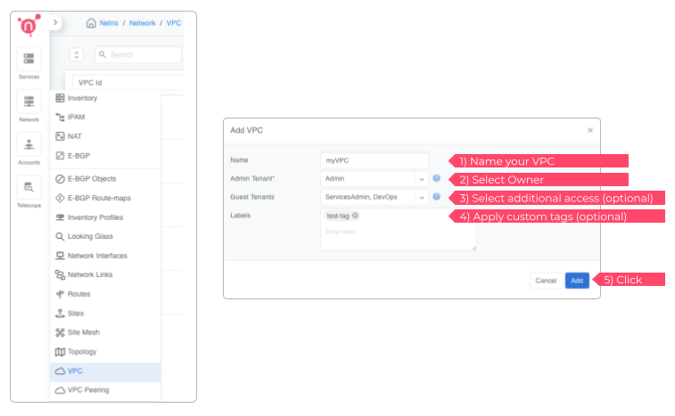
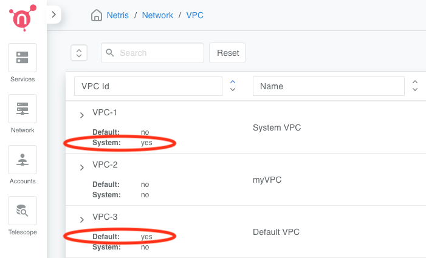
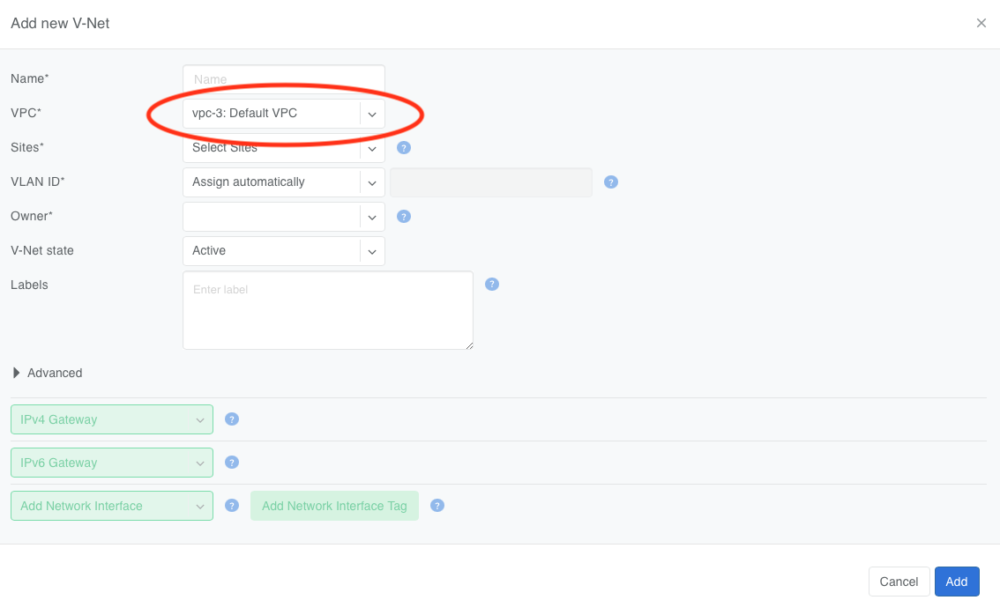

.. meta::
    :description: Netris VPC

.. _vpc_top:

==========
VPC
==========

.. contents:: Table of Contents
   :local:
   :depth: 3

Overview
========

A **Netris VPC** lets you operate a group of resources inside a logically segregated virtual network. A VPC acts as a VRF in traditional networking: it allows overlapping IP ranges across different VPCs while keeping each VPC's resources securely managed and isolated from every other VPC.

VPC is the highest object in the Netris hierarchy and spans every :doc:`Site <site>` in the deployment. Everything else described in this document — V-Nets, IPAM allocations and subnets, BGP sessions, NAT rules, load balancers, static routes — is a **child object** that belongs to exactly one VPC (with VPC Peering being the one construct that explicitly relates two VPCs to each other).

You can create, edit, and remove VPCs under ``Network -> VPC``.

.. raw:: html

   
<em>Netris VPC concept diagram</em>

Adding a new VPC
-----------------

1. Navigate to ``Network -> VPC`` in the web UI.
2. Click **Add**.

.. raw:: html

   
<em>Add new VPC dialog</em>

.. list-table:: VPC Fields
   :header-rows: 1
   :widths: 20 45 35

   * - Field
     - What it does
     - Notes / defaults
   * - **Name**
     - Name of the VPC.
     - Optional.
   * - **Admin Tenant**
     - The tenant that owns the VPC. Users granted access as this tenant can manage all of the VPC's own parameters (name, tags, tenants, and so on).
     - Required.
   * - **Guest Tenants**
     - Additional tenants (other than the Admin Tenant) allowed to add and remove services *inside* the VPC — V-Nets, L4 Load Balancers, Server Clusters, IPAM subnets, and the like — without being able to change the VPC's own parameters.
     - Optional, multiple allowed. See :doc:`accounts` for more on Admin vs. Guest Tenants.
   * - **Tags**
     - Free-form labels you assign to the VPC for search/filter in the VPC listing. Same generic tagging mechanism used on V-Nets and other objects — it has no configuration effect on the VPC itself.
     - Optional, multiple allowed. Letters, numbers, ``_``, ``=``, ``-``, and ``.`` only.

System VPC and Default VPC
===========================

Every Netris Controller ships with one VPC — commonly called **VPC-1** — pre-provisioned and impossible to delete. By default, VPC-1 carries two separate roles at once: it is both the **System VPC** and the **Default VPC**. These two roles exist for different reasons, and understanding the difference matters once you start creating additional VPCs for tenants.

.. raw:: html

   
<em>System and Default are independent flags: VPC-1 is System but not Default, VPC-3 is Default but not System</em>

.. note::
   Nothing below requires System VPC and Default VPC to be the same VPC — it's simply how every Controller ships today. Any VPC can be flagged as the Default VPC. The System VPC role, however, always stays with VPC-1; it isn't a flag you can move to another VPC.

What the Default VPC is for
----------------------------

The Default VPC is a **convenience/fallback mechanism**, not a trust or security boundary. VPC is a required field on every VPC-scoped object — it's just that the value doesn't always have to come from the caller. Exactly one VPC in a deployment is flagged as default, and that VPC is what the Controller substitutes whenever a value is required but none was explicitly given.

In the web UI, this is visible directly: the Default VPC is the VPC that comes pre-populated/auto-selected in "Add new" dialogs for VPC-scoped objects. You're free to change the selection before saving, but if you don't, the object is created in whichever VPC is flagged default. Over the API or in Terraform, the same substitution happens if a call omits the VPC field: the Controller doesn't reject the request for missing a required value, it fills that value in with the Default VPC.

.. raw:: html

   
<em>The VPC field in an Add new dialog comes pre-selected to whichever VPC is flagged Default</em>

This exists mainly for historical reasons: earlier versions of the Netris API/Terraform provider predate the VPC field entirely, from back when a deployment had only one VPC. Once multi-VPC support shipped, existing integrations that had never set a VPC field kept working unmodified because the Controller quietly substituted the Default VPC. Modern Netris integrations set the VPC field explicitly on every object, so in a current deployment, anything that lands in the Default VPC via this substitution is more often a sign of a missing or mistaken VPC field in a call than an intentional placement.

.. tip::
   Because the Default VPC is a catch-all for calls that didn't specify a VPC, don't treat objects that land there as trusted or related to each other. Two V-Nets that both end up in the Default VPC through omission may belong to two completely different tenants that just happen to share the same "nobody specified a VPC" fate. Periodically auditing the Default VPC's contents is a good way to catch missing ``VPC`` fields in Terraform/API calls.

What the System VPC is for
----------------------------

The System VPC is the **trust boundary and anchor point for platform/infrastructure objects** — the things every deployment needs regardless of how many tenants it serves. Concretely, the System VPC is where the following live:

* **Switch loopback and VTEP IPAM subnets.** Switch main loopback IPs operate in the underlay and, by definition, don't belong to any VPC/VRF — but Netris IPAM still needs a VPC to file that subnet under, since every IPAM subnet has a VPC parent. The System VPC is that home. (This is purely an IPAM bookkeeping detail — the loopback IPs themselves are never actually configured inside the System VPC's VRF on the switch.)
* **eBGP sessions terminated on SoftGate.** These are your upstream/external BGP sessions — peering with providers, border routers, or an IX — and they define the reachability Netris uses for SNAT egress and DNAT/load-balancer ingress. Any eBGP peer whose BGP Router is set to a SoftGate node must be created in the System VPC; the Controller does not enforce this for BGP peers terminated on a switch or V-Net (see :ref:`vpc_child_objects` below), but SoftGate-terminated peers are only supported in the System VPC.
* **The public/exit side of NAT and Load Balancer services.** When you define a NAT rule or a load balancer, the VPC field you pick selects the *local tenant VPC* being served — i.e., where the private workload lives. The public-facing side (the SNAT pool, or the DNAT/load-balancer virtual IP) is always the System VPC; you don't select it, and it can't be changed to another VPC.

Because of this role, the System VPC is meant to hold **infrastructure objects that the operator implicitly trusts**, not tenant workloads. Avoid creating V-Nets or servers in the System VPC and then relying on SNAT/DNAT or VPC Peering to reach them from tenant VPCs — this is not a supported pattern, even though the Controller does not block it outright. Keep tenant services in tenant VPCs, and use the System VPC only for the objects listed above.

.. note::
   If you need a VPC for the operator's own shared infrastructure services (DNS, NTP, monitoring, and the like) that tenants should not have access to, create a dedicated VPC for it — do not reuse the System VPC for this purpose. The System VPC is for the platform's own BGP/NAT/loopback plumbing, not for "services I, the operator, own."

Why they're the same VPC today
--------------------------------

VPC-1 doubles as both System VPC and Default VPC because of how multi-VPC support was introduced. Earlier Netris versions supported only a single VPC per deployment, so every object belonged to it by definition. When multi-VPC support shipped, that single, pre-existing VPC had to keep working as both the anchor for infrastructure objects (System VPC) and the landing zone for objects with no VPC specified (Default VPC), so upgraded deployments would keep functioning without any changes. New deployments inherited the same shipping default.

The practical result: anything you forget to assign a VPC to lands in the same VPC used for switch loopbacks, upstream BGP, and NAT/load-balancer exit traffic. If that combination doesn't fit your operational model, you can point the Default VPC flag at a different, non-system VPC — the System VPC's specific roles (loopbacks, SoftGate-terminated BGP, NAT/LB exit) stay with VPC-1 regardless of which VPC is flagged as default.

.. _vpc_child_objects:

VPC child objects
==================

The table below lists the objects that belong to a VPC, what selecting a VPC for that object actually controls, and any placement restrictions.

.. list-table::
   :header-rows: 1
   :widths: 20 45 35

   * - Object
     - What the VPC field controls
     - Notes
   * - :doc:`V-Net <vnet>` (``Services -> V-Net``)
     - The VPC the network segment (and its endpoints) belongs to.
     - A V-Net belongs to exactly one VPC and one or more Sites.
   * - IPAM Allocation / Subnet (``Network -> IPAM``)
     - The VPC the allocation or subnet is filed under.
     - See :doc:`ipam`. A subnet's *Purpose* (common, loopback, management, load-balancer, nat, inactive) determines how it can be used; loopback, load-balancer, and nat subnets are conventionally created in the System VPC (see above).
   * - E-BGP peer (``Network -> E-BGP``)
     - The VPC the BGP session's routes are injected into.
     - The **BGP Router** field determines where the session terminates: a SoftGate-terminated session must use the System VPC; a switch- or V-Net-terminated session (Direct Connect, no SoftGate) can use any VPC, but doesn't get SoftGate NAT/load-balancer services.
   * - Static Route (``Network -> Routes``)
     - The VPC the route applies to.
     - Useful for pointing a VPC's default route somewhere other than a SoftGate, or for temporary migration routes.
   * - NAT rule (``Network -> NAT``)
     - The **local/tenant** VPC whose workloads are translated.
     - The public/exit side of the translation is always the System VPC — it is not a selectable field.
   * - :doc:`L4 Load Balancer <l4-load-balancer>` (``Services -> Load Balancer``)
     - The **local/tenant** VPC containing the backend endpoints.
     - Same exit behavior as NAT: the frontend virtual IP is served from the System VPC via SoftGate.
   * - VPC Peering (``Network -> VPC Peering``)
     - Two VPCs whose routes are selectively exchanged.
     - Commonly used to reach shared services (DNS, storage, and the like) from multiple tenant VPCs without giving those tenant VPCs a route to each other. See the VPC Peering section of :doc:`network-policies`.
   * - :doc:`Server Cluster <server-cluster>` (``Services -> Server Cluster``)
     - Can create a brand-new VPC for you.
     - Setting VPC to **Create New** provisions a VPC along with its V-Nets and IPAM subnets in one step.

.. tip::
   As a rule of thumb: if an object's VPC field is described above as "local/tenant," selecting a tenant VPC there does not put that object's public-facing side in the same VPC — the System VPC is always the other end for NAT and load-balancer exit traffic.
