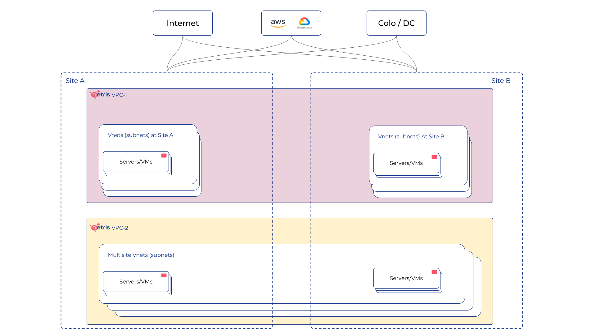

.. meta::
    :description: Netris VPC

======================
Netris VPC
======================

The Netris VPC offers you the ability to operate your resources within a logically segregated virtual network. You can create, edit, and remove VPCs as needed. The VPC acts as a VRF in traditional networking, providing the flexibility to employ identical IP ranges across various VPCs while maintaining secure management and operation of resources.

Netris Controller is preconfigured with a default system VPC-1. Use the default VPC, and create additional VPCs as needed in the future.

The following diagram shows a VPC concept in the Netris Controller. 

VPC is the highest entity in the hierarchy and it spreads over all Sites. 
Take a look at the VPC features and services.

Sites
-----

For each individual deployment, such as a data center, you should define it as a Site. All network components and resources should be associated with their respective Site and VPC. Netris offers integrations with Metal and Cloud providers, which are also considered Sites. 

Physically connected sites function like an availability zone. This means that two V-Nets (Subnets) will communicate using the direct link, and even a single V-Net can span within an availability zone. Sites that are not physically connected function like regions. And Netris SiteMesh, a Wireguard-based site-to-site VPN, can be used to enable communication between these regions.

IPAM
----

You have the ability to create IP Allocations and Subnet assignments for a VPC, and these may overlap between different VPCs. A Subnet can be assigned to multiple sites if you aim to extend your V-Net across various locations.

V-Nets
------

V-Net is a virtual networking service that provides Layer-2 (unrouted) or Layer-3 (routed) virtual network segments in VPC. V-Net is assigned to one VPC and one or multiple sites. Your endpoints (servers, VMs) are connected to V-Nets.

**Note: multisite feature requires a direct physical link between Sites.**

External connections
--------------------

You can connect your VPC to ISP providers or other segments of your network using Netris E-BGP service, or statically by defining a V-Net and using Net->Routes (for natively integrated Bare Metal Cloud Providers please refer to the provider-specific tutorial, as external connections usually establish automatically

SiteMesh connections
--------------------

Connect your VPCs over an automatic Wireguard-based Site-to-Site VPN across multiple Sites if you don't have a direct link between those Sites.

**Note: works only in the system default VPC (limitation is planned to be lifted in Netris v. 4.1.0).**

NAT services
------------
SNAT allows your endpoints to communicate with the Internet. DNAT is also available.

**Note: works only in the system default VPC (limitation is planned to be lifted in Netris v. 4.1.0).**

Load-balancing service
----------------------

Use L4LB service to share the load between your endpoints. 

**Note: works only in the system default VPC (limitation is planned to be lifted in Netris v. 4.1.0).**

Access lists
------------

ACLs provide a layer of security that acts as a firewall for controlling traffic in and out of one or more subnets.

**Note: works only in the system default VPC (limitation is planned to be lifted in Netris v. 4.1.0).**

Working with Netris VPC
-----------------------

You have the flexibility to create and manage your VPCs using any of the interfaces listed below:

* Web interface of the Netris Controller
* Terraform Netris provider
* Kubernetes Integration
* REST API

